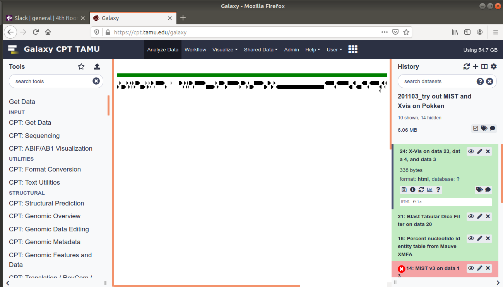

> ### Agenda
>
> 1. Background
> 2. Procedure
>
{: .agenda}

# Background
The X-Vis from GFF3/FASTA workflow generates an HTML output as shown in figure 1. Label editing and export in high-resolution format, such as needed to comply with journal requirements for publication, is not possible with the HTML display. However, a Scalable Vector Graphic file (.svg) can be extracted from the X-Vis output for use in preparing publication figures. While not perfect, the steps to taking advantage of this trick are detailed below. 

|Figure 1. X-Vis dataset as viewed in Galaxy.|
|:--:|
||

# Procedure

> ###  Browsers…
> * The following screenshots were made using **Mozilla Firefox**. Other browsers will be different, though the concept is the same.
{: .comment}

1. With the mouse pointer over the HTML image in Galaxy (green bar and arrows in center pane of figure 1), right click and select "Inspect Element". This will bring up a new window with the HTML code as shown in figure 2 (blue arrow). The code describning the field in which the graphic is displayed will be highlighted, as shown in figure 2 (red arrow). The line of code above this, beginning with ">svg width" contains the SVG data. Right click on that line and then select Copy>>Copy Outer HTML as shown in figure 3 red arrow).

|Figure 2. Inspect Element dialog box (blue arrow) showing highlighted element (red arrow).|
|:--:|
||

|Figure 3. Copy menu showing "Outer HTML" option.|
|:--:|
||

2. Open a plain text editor. Paste your copied code into the plain text editor and save with the .svg extension. You can now open this file in your favorite vector graphic drawing software. An open-source option is [Inkscape](https://inkscape.org/).

Alternatively, if you do not want to create an editable Scalable Vector Graphic (.svg) file, you can instead simply save the file as a flat image, such as the PNG format. In that case, you can use [SVG viewer](https://www.svgviewer.dev/) or an equivalent. Paste the code from the browser Element Inspector into SVG viewer (figure 4) then save it as a .png (red arrow) file. Some viewers, such as [SVG Viewer](https://www.svgviewer.dev/) also allow you to save the image as a .svg file (red arrow). 

|Figure 4. PNG data in SVG Viewer.|
|:--:|
||

