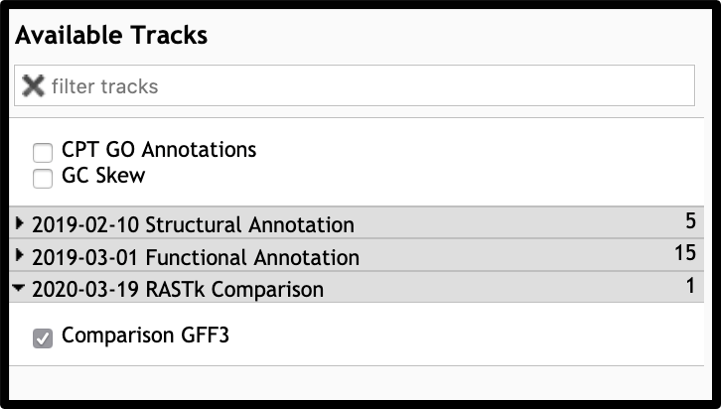
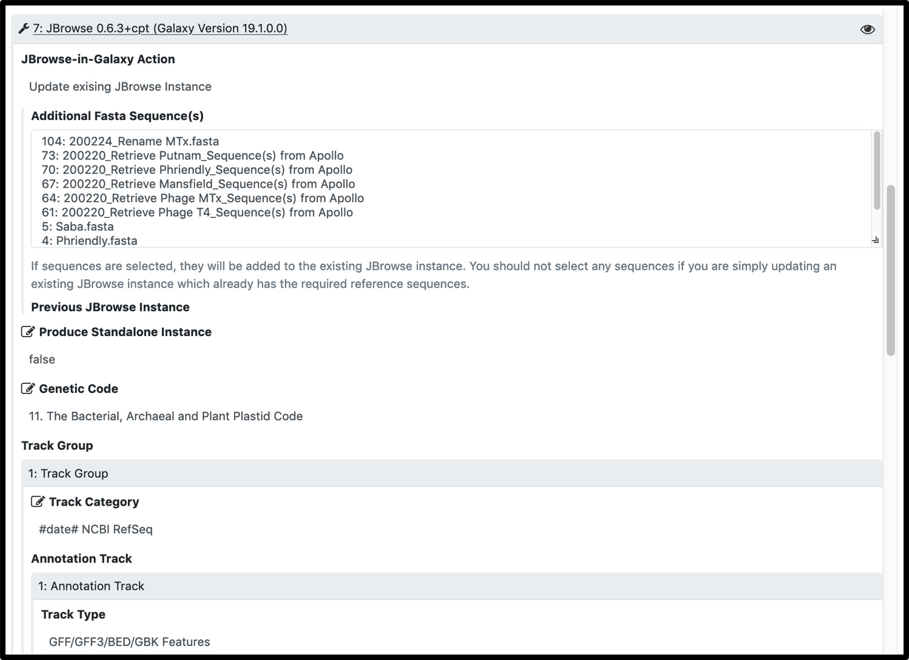

While annotating a genome in Galaxy, it is possible that the annotation progress could be improved by the addition of a new evidence track that was not produced by the structural or functional workflows.

> ### Agenda
>
> In this tutorial, we will deal with:
>
> 1. Introduction
> 2. Custom Workflows
> 3. Troubleshooting
> {:toc}
>
{: .agenda}

# Introduction
The analyses that the basic [Structural](https://cpt.tamu.edu/training-material/topics/phage-annotation-pipeline/tutorials/structural-annotation-workflow/tutorial.html) and [Functional](https://cpt.tamu.edu/training-material//topics/phage-annotation-pipeline/tutorials/functional-annotation-workflow/tutorial.html) workflows provide a good start for phage genome annotation. When additional, updated, or custom analyses are performed, those data can also be added to Apollo as evidence tracks if they are in the appropriate format. This includes custom BLAST analyses, comparison annotation data, or any properly formatted GFF3 data with coordinates that match the genome for the organism in question.

# Custom Workflows
The following are useful workflows that can be searched for in the [published worklflows](https://cpt.tamu.edu/galaxy-pub/workflows/list_published) on Galaxy and imported.

1. Published workflow: GFF3 to Apollo Evidence Track
> * Adds gff3 evidence tracks to Apollo organisms. 
> * **Note:** This is usually used on data coming from Genbank and allows comparison to features called by others.
2. Published workflow: Custom BLASTp to Apollo Evidence Track with variations UserDB and LocalDB
> * Runs BlASTp against a user-created or locally installed database and creates a new Apollo track.
3. Published workflow: BLAST antiCRISPRdb to Apollo Evidence track
> * BLAST your proteins against the current anti-CRISPR database (import from Shared Data) and add evidence track to Apollo.

# Troubleshooting
When adding custom evidence tracks is not working for you, consider the following reasons for remediating the problem.

1. If your custom data is not properly formatted, the category may be added to Apollo, but with empty evidence tracks. In that case, the data formatting needs to be carefully inspected to ensure it fits the spec required for that file type. Users are encouraged to compare their data files to datasets in Galaxy that are known to be successfully added to Apollo. Additionally, check to make sure that any conversions performed in Galaxy did not yield empty datasets.

2. When your uploaded gff3 is not listed as an input option, it is because the auto-detect classified it a a gff file, and it must be manually changed.

3. In order to ensure the evidence track categories have the name you want, you can change the preset "Category label" (gray header name) in  the workflow by changeding at runtime in JBrowse settings.

4. If the worflow is failing, the most common reason is the names of the comparison gff3 and the Apollo organism do not match. Workflow prompts for name change, but the parameters have to be manually expanded.

