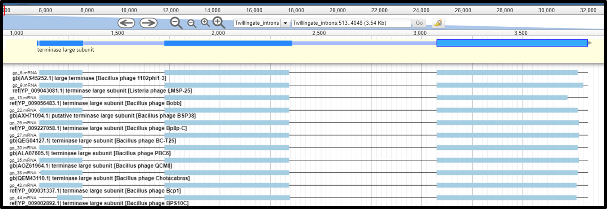

> ### Agenda
>
> 1. Introduction
> 2. Uses Cases
>    > * Intron Interrupted Genes
>    > * Frameshift
>    > * Separated Gene Calls Resulting from Low-Quality Long Sequence Reads
> {:toc}
>
{: .agenda}

# Introduction

# Uses Cases

## Intron Interrupted Genes
Based on the tool output, protein alignments to the target proteins in the database need to be carefully verified to determine the interrupted exon boundary.

> 1. When the exon boundary can be identified (based on the alignment positions to the known proteins), drag to set the exon boundary to the gene features. SD sequence can be deleted easily from the second or the third exon. Merge the exons together (select by clicking and holding down “shift”, and right click, select “merge”). If needed, set the first base of the fused gene as translation start (right click on the first base, click translation start), and the last base of the fused gene as translation end (right click on the last base and click translation end). Check the accuracy of the fused protein sequence. Using an intron interrupted terminase as example, the fused gene will be annotated as “Terminase large subunit”, with a note stating “contains introns with known boundaries”.

> 2. When it is not possible to identify the exon boundary, the exons can not be merged together (because intron splicing sites are not known and the merged sequence will be be complete). In this case, NCBI does not accept keeping the exons as separate intron-truncated CDS fragments (results of an interrupted gene), so the whole region needs to be annotated as one gene, with note indicating that the coding boundaries of this gene are not determined. In the example below where the exon boundary can not be determined, the three exons can NOT be annotated as CDS. Instead, the three coding genes need to be DELETED and a new gene that spans from the start of the first gene, to the end of the last gene needs to be created. This gene feature needs to be created off Apollo (either in the 5 column table submitted to Genbank, or in a software like Artemis) as it can not be promoted from any of the gene call tracks. This new gene will not have associated CDS and will have a note stating "coding region spans undetermined; unable to determine intron boundaries"

## Frameshift

## Separated Gene Calls Resulting from Low-Quality Long Sequence Reads
