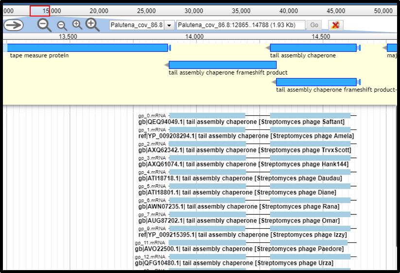
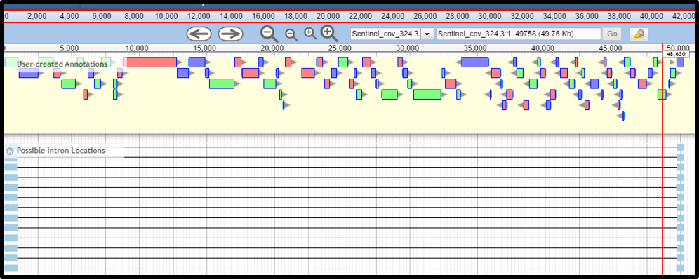

> ### Agenda
>
> 1. Introduction
> 2. Use Cases
>    > * Intron Interrupted Genes
>    > * Programmed Translational Frameshifts
>    > * Genome Opened in the Middle of a Gene
>    > * Interrupted Genes Due to SNPs, InDels, or Sequencing errors
>
{: .agenda}

# Introduction
The [Intron Detection tool](https://cpt.tamu.edu/galaxy/root?tool_id=edu.tamu.cpt2.phage.intron_detection) is typically run as part of the [functional workflow](https://cpt.tamu.edu/training-material//topics/phage-annotation-pipeline/tutorials/functional-annotation-workflow/tutorial.html), and can also be run independently.  The intron detection tool parses XML-formatted BLASTp results to determine whether multiple query proteins from the phage genome have amino acid identity to a single target protein in the database.  The tool requires that the separated gene fragments in the query genome exist within a user-defined number of bases (with the default set at 10,000), and the protein percentage identity cut off is user definable.  

Based on this principle, intron detection tool can be used to find interrupted genes.  These include finding legitimate introns (often in essential genes), programmed translational frameshifts (frequently found in capsid proteins or tape measure chaperones), interrupted genes due to SNPs, InDels, or premature stops produced by sequencing errors (such as those introduced by long-read sequencers),  and other split or duplicate gene phenomenons. This tool can also detect separated genes that span the genome ends, for cases where a genome may circularize or if it is opened in the middle of a gene.

# Use Cases

## Intron Interrupted Genes
Introns are self-splicing RNAs usually found in essential genes, and are not commonly predicted as part of annotation pipelines.  The most reliable way to find the intron interruption boundaries is by manual inspection of high-quality alignments of the intron-disrupted phage protein segments against a non-interrupted homolog from the database.  For each protein pair/cluster detected by the intron detection tool, protein alignments to the target proteins in the database need to be carefully verified to determine the interrupted exon boundary. When uninterrupted analogs do not exist in the database, or the nearest uninterrupted analog has weak sequence identity, boundaries cannot be accurately determined bioinformatically. 

> 1. When the exon boundaries can be identified based on protein alignments, drag to set the exon boundary to the gene features. SD sequence can be deleted easily from the second or the third exon. Merge the exons together (select by clicking and holding down “shift”, and right click, select “merge”). If needed, set the first base of the fused gene as translation start (right click on the first base, click translation start), and the last base of the fused gene as translation end (right click on the last base and click translation end). Check the accuracy of the fused protein sequence. Using an intron interrupted terminase as example, the fused gene will be annotated as “Terminase large subunit”, with a note stating “contains introns with known boundaries”.

> 2. When the exon boundary can not be determined based on protein alignments, the exons can not be merged together (because intron splicing sites are not known and the merged sequence will not be complete/correct). In this case, NCBI does not accept keeping the exons as separate intron-truncated CDS fragments (results of an interrupted gene), so the whole region spanning introns and exons needs to be annotated as one gene, with note indicating that the coding boundaries of this gene are not determined. In the example below, the three CDS are fragments of an interrupted tape measure protein but the exact exon boundaries can not be determined based on protein allignments.  The three exons can NOT be fused together nor can be annotated as separate CDS. Instead, the three coding genes need to be **DELETED** from the Apollo annotation track, and a new gene that spans from the start of the first gene, to the end of the last gene needs to be created. This gene feature needs to be created off Apollo (either in the 5 column table submitted to Genbank, or in a genome editing software like Artemis) as it can not be promoted from any of the gene call tracks. This new gene will not an have associated CDS and will have a note stating "coding region spans undetermined; unable to determine intron boundaries"

## Programmed Translational Frameshifts
There are several kinds of important proteins in phages that are produced via programmed translational frameshifting mechanisms, such as the capsid or tail proteins and the tail tape measure chaperones.  When the frameshifted downstream open reading frame of a protein has been called as a separate protein-coding gene (often without a strong SD), it can be detected by the intron detection tool. In this case, the tool output track will show two gene segments with a very short intervening sequence; this represents two parts of a protein fused by a programmed translational frameshift, rather than the post-trancriptional mRNA processing found in introns.  However in cases where no experimental data exists for the matched protein in the database, the potential for an interrupted gene should be interpreted with caution.  Below is an example of a programmed translational frameshift commonly found in the tail tape measure chaperone proteins, which produce a short and extended form of these chaperones.  See the [Annotating Tape Measure Chaperone Frameshifts tutorial](https://cpt.tamu.edu/training-material/topics/phage-annotation-pipeline/tutorials/annotating-tmp-chaperone-frameshifts/tutorial.html) for how to annotate this type of frameshift.

## Genome Opened in the Middle of a Gene
In cases where a genome is opened in the middle of a gene, and the interrupted gene fragments are detected by the gene call programs in the [structural workflow](https://cpt.tamu.edu/training-material/topics/phage-annotation-pipeline/tutorials/structural-annotation-workflow/tutorial.html), the intron detection tool can also detect the separated gene that span the genome ends. In the example below, the genome is opened in the middle of a gene, which is detected by the tool. Be aware that these are protein fragments that are linked as though the genome were circularized.  You may consider [reopening the genome](https://cpt.tamu.edu/training-material/topics/additional-analyses/tutorials/reopening-apollo-with-annotations/tutorial.html) to avoid interrupting a gene.

## Interrupted Genes due to SNPs, InDels, or Sequencing Errors
Finally, the intron detection tool can be helpful for finding genes disrupted due to mutations, alternative gene arrangements, or sequencing errors (such as those produced by nanopore sequencing). Users will need to perform additional analysis to determine the true nature of these types of gene interruptions.  
