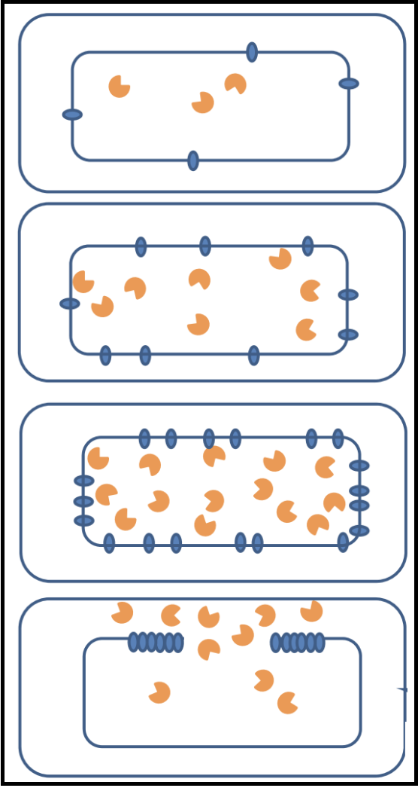
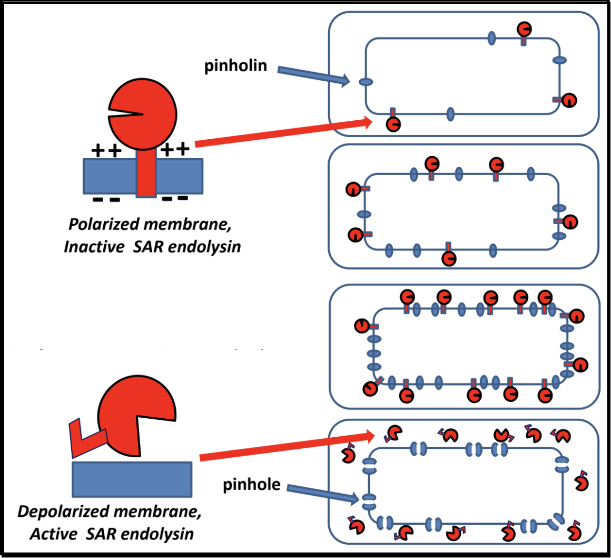
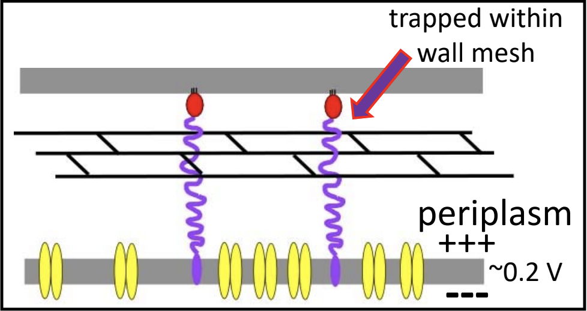
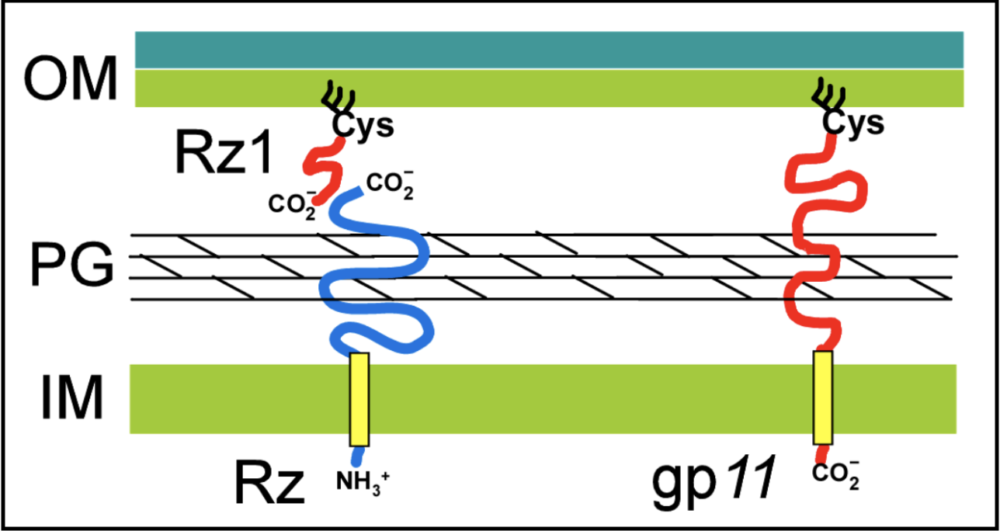
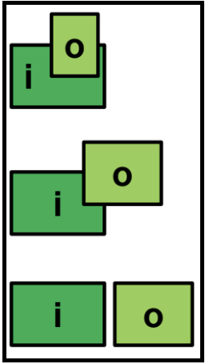
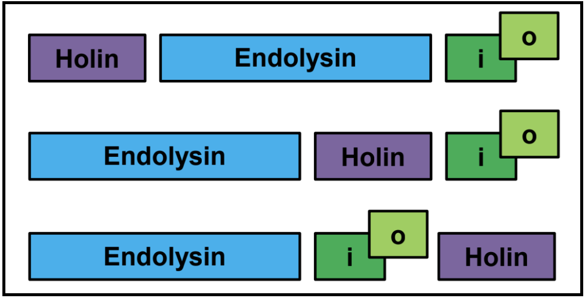

> ### Agenda
>
> 1. Background on Lysis Genes
>    > * Holin-Endolysin Pathway
>    > * Spanins
>    > * Spanin Architectures: i-spanin/o-spanin, u-spanin
>    > * Expected Genetic Context
> 2. Finding the Endolysin
>    > * Conserved Domain (InterPro)
>    > * BLAST Hits
>    > * SAR Endolysins
>    > * Endolysin Type
> 3. Finding Holins and Antiholins
>    > * TMHMM Tracks - Transmembrane Prediction
>    > * BLAST Homology
>    > * Basic Considerations When Looking for Holins
>    > * Annotating Holin/Antiholin Pairs
> 4. Finding Spanin Genes
>    > * Looking for the genetic signatures
> 5. Missing Lysis Genes
> {:toc}
>
{: .agenda}

# Background on Lysis Genes

Lysis is an essential stage of the phage in section process, in which phage proteins cause the bacterial cell wall to break which allows the release of the newly formed phage particles. 

> ###  What are the different bacterial cell envelope structures?
>    > ### 
>    > 
> {: .solution}
{: .question}

There are a few different proteins that work together executing different roles in this process:

> * A **holin** is a small cytoplasmic membrane protein that forms the lethal membrane "hole" at a programmed time. By doing so, it controls the timing of lysis, thus the length  of the cycle. In lambda, this is the S gene.
> * An **antiholin** is a protein that binds to and inhibits a holin. This exerts additional control lysis timing.
> * An **endolysin** is a muralytic enzyme that degrades the peptidoglycan layer of the bacterial cell. Endolysin activity is controlled by holin activity. In lambda, this is the R gene.
> * A **spanin** is a protein that disrupts the outer membrane in Gram-negative hosts, causing the breakage of the membrane and subsequent release of phage. Spanin activity is controlled by endolysin action. In lambda, the spanin genes are Rz and Rz1. 
> * A **mycolase** is an enzyme that degrades the mycelia acid layer in *Mycolata* hosts.

Together, these proteins target the different layers of a bacterial cell. In the paradigm phage lambda, lysis is completed via the activities of holins, endolysins, and two different kinds of spanins.

## Holin-Endolysin Pathway

> ###  Classes of Holins
> There are at least 4 topological classes of holins, and multiple families exist within each class, except for class III.
>
> 
>
> Most of these consist of two or more TMDs linked with shorts loops, and have a short cytoplasmic C-terminus that is rich in positively charged amino acids. **Only class III** has a globular periplasmic domain (circled in red above). Class III holins are found in T-even phages, as well as T5.
{: .tip}

When holins are translated, they harmlessly accumulate as dimers in the cytoplasmic membrane. They are able to move around the membrane without affecting bacterial function  and maintaining the membrane potential. Once a critical concentration in the membrane is reached, the holins suddenly aggregate into "rafts," and these rafts undergo a conformational change into micron-scale holes; this marks the end of the infection cycle.

The formations of these holes collapses the membrane potential and stops macromolecular synthesis, effectively killing the cell. Once the holins have formed holes in the membrane, the **endolysin** can be released from the cytoplasm to attack the peptidoglycan. Holin-mediated lysis benefits the infecting phage by preserving macromolecular stability of the host cell until the instant that lysis begins.

> ###  What is the current model of hole formation?
>    > ### 
>    > It is believed that the raft formation in tthe membrane squeezes out lipids that may be between the holins at that point in the infection cycle. The lipids, potentially acting as a sort of insulator, being lost may cause a "short circuiting" and subsequent loss of the proton motive force (PMF); losing the PMF causes the rearrangement of holins into holes.
> {: .solution}
{: .question}

>  Pinholins and SAR Endolysins
> * A **pinholin** has similar functionality to a holin, but will instead form ~1000 small heptameric holes in the membrane, called "pinholes." The diameter of the pinholes is less than 2 nm, which is too small to allow an endolysin to pass through the hole. This system requires a particular endolysin called a SAR endolysin.
> * A **SAR endolysin** (SAR = **S**ignal **A**nchor **R**elease domain) accumulates in the cytoplasmic membrane as an inactive enzyme, tethered by an N-terminal transmembrane domain (TMD). When the pinholes collapses the membrane potential, the TMD is able to exit the bilayer; the SAR endolysin is released, allowing it to refold into its active form and attack the peptidoglycan.
> * The primary difference between the holin-endolysin and pinholin-SAR endolysin pathways is *how* the holin/pinholin activates the endolysin/SAR endolysin (respectively).
> * 
{: .comment}

## Spanins

Spanin proteins span the periplasm from the inner membrane to the outer membrane. Lambda codes for two spanins - Rz, an **i-spanin** (inner membrane protein), and Rz1, an **o-spanin** (outer membrane lipoprotein). The i-spanin has a single TMD; the C-termini of the two spanins interact to form complexes that reach from the inner membrane to the outer membrane. During the infection cycle, spanins are accumulating in the inner and outer membranes. Before lysis begins, however, the spanins are trapped within the peptidoglycan. This prevents the spanins from oligomerizing, thus they are unable to execute their function of disrupting the outer membrane.

To complete lysis, the endolysin activity is necessary to free the spanins from the peptidoglycan layer.

Once the spanins have been liberated from the peptidoglycan that was keeping them apart, they can oligomerize and destroy the outer membrane by membrane fusion; this allows for the release of all the phage particles that were made within the bacterial host.

>  U-Spanins
> **U-spanins** are unimolecular spanins that reach from the inner membrane (anchored by a C-terminus TMD) to the outer membrane. A u-spanin is present in phage T1, called gp*11*, associated with a pinholin and a SAR endolysin. *U-spanins found in nature are only associated with pinholins and SAR endolyins.* The figure below shows a structural comparison between lambda's i-spanin and o-spanin (Rz and Rz1) and phage T1's u-spanin.
>
> 
>
{: .comment}

## Gram-Negative Hosts

Spanins are only expected in the genomes of phages that infect Gram-negative hosts. From detailed molecular characterization of the lamdba spanins Rz and Rz1, see this [recent review](https://www.ncbi.nlm.nih.gov/pubmed/30635077), and an [in-depth bioinformatic analysis](https://www.ncbi.nlm.nih.gov/pubmed/30219026) of many more spanin sequences, we know the essential genetic signatures and genomic architectures to search for in novel genomes. 

## A refresher on SPII signals and lipoboxes

The lipobox consists of a conserved sequence that ends in a Cys residue. That Cys is lipid modified with a diacylglycerol on the S atom and a third FA on the N-terminal amine, to make a lipoprotein. This covalent linkage effectively anchors the protein to the outer membrane.

A signal sequence allows for proper secretion and localization of a protein. Below is the makeup of a typical SPII signal sequence, which includes a lipobox with its Cys residue after the C domain.

## Spanin systems: two-component and unimolecular

> The two-component spanins encode separate proteins for the spanin subunits. 
> 
> * First, is the inner membrane spanin (**i-spanin**)
>    > * 1 N-terminal TMD
>    > * Small (100-200 amino acids)
>    > * Functionally linked to *o-spanins*
>
> Second, is the outer membrane spanin (**o-spanin**)
>    > * N-terminal SPII signal
>    > * 1 N-terminal lipobox
>    > * Genetically encoded completely/partially embedded, or just downstream of the i-spanin (see below)

> Alternatively, some phages encode a single protein with the characteristics of both the i- and o-spanins, called the unimolecular spanin (u-spanin). 
> * u-spanin
>    > * 1 N-terminal SPII signal
>    > * 1 C-terminal TMD 

## Spanin Two-component gene architectures: embedded, overlapping, and separate

While the u-spanin should be easy to identify based on its genetic signatures colocalized within one coding region, the two-component spanins present a more varied architecture, an important factor in their identification. While the spanins can exist in a typical side-by-side genetic context, some spanin cassettes are instead present as overlapping, or even embedded genes. This is relatively rare, and actually can help in spanin identification. 

> ###  An Important Note on Spanin Gene Architecture
> The i-spanin is **never** embedded in the o-spanin.
{: .comment}

## Expected Genetic Context

When the lysis genes are encoded as a module, the order is not necessarily conserved. 

> ###  Distributed Lysis Genes
> Especially in larger phages, like T4, the lysis genes will be distributed throughout the genome. Unless they have protein similarity to known (experimentally characterized) lysis genes, it is often not possible to confidently annotate lysis genes in that case.
> 
> 
>
> {: .comment}

Note that in many cases, there will be two genes in tandem that encode transmembrane domain-containing proteins. These are sometimes predicted to be a holin/antiholin pair, or they may be two holins. 

# Finding the Endolysin

As an enzyme, the endolysin is the most conserved lysis gene, and therefore most likely to be identified. The endolysin usually has a conserved domain, or amino acid similarity to characterized proteins. Note that endolysin annotations exhibit significant variability in terminology, look out for lysozyme, muramidase, muraminidase, endopeptidase, and variations on those themes.

## Conserved Domain (InterPro)
Conserved domains are typically found in the InterProScan evidence track in Apollo.

## BLAST Hits

BLASTp hits to known and characterized lysozymes or endolysins are a good clue to finding the endolysin. Check BLAST hits in against canonical phages and curated databases like SwissProt first.

## SAR Endolysins

Pay careful attention to the N-terminus of your endolysin sequence. If there is evidence of a transmembrane domain, or a long stretch of weakly hydrophobic residues (especially Glycines, Alanines, and Serines), you may be looking at a SAR endolysin!

> * **Transmembrane domains**
>    > * Generally 15-20 amino acids in length
>    > * Hydrophobic, uncharged (Ile, Leu, Val, Phi, Tyr, Trp, Met) 
>    > * Lys can snorkel if up to three residues inside the hydrophobic region, and adjacent oppositely charged residues can neutralize each other in the same helix
>    > * Alpha-helical

> * **“Positive Inside” Rule**
>    > * The inner membrane carries a net positive charge on the outside surface
>    > *  Membrane proteins will take a topology that keeps net negative charges on the outside, and net positive charges on the inside
>    > *  Note that TMD prediction tools often mistake SPI and SPII signals for N-terminal TMDs!
>    > *  Orientation matters, because a SAR endolysin must have its catalytic domain in the periplasm

> * **SAR (Signal-Anchor-Release) domain**
>    > * Similar to transmembrane domains, but enriched in Gly, Ala, and Ser
>    > * Often missed by prediction software
>    > * Always check the N-terminus of your endolysin protein!

## Endolysin Type

Where possible, it is preferable to name an endolysin according to its known type. Examine the InterProScan results and BLAST hits to help determine its catalytic type. These are some characterized examples you may find in the BLAST tracks.

> * **Glycosidase** (T4 E)

> * **Transglycosidase** (lambda R)

> * **Amidase** (T7 3.5)

> * **Endopeptidase** (T5 Lys)

# Finding Holins and Antiholins

## TMHMM Tracks - Transmembrane Domain Prediction

> ###  An Important Note
> If the holin and antiholin are **NOT NEXT TO** the endolysin, then it can only be identified if there is *A SINGLE* small TMD-containing protein in the entire genome, or via BLAST homology.
{: .tip}

## BLAST Homology

## Basic Considerations When Looking for Holins

> * Holins usually have 1-4 TMDs

> * Holins are small (70 - 220 amino acids)

## Annotating Holin/Antiholin Pairs
The antiholin can be encoded partly or completely overlapping the holin. There are several known cases of dual-start holin-antiholin pairs.

# Spanins

The typical signals for spanins are displayed in Apollo in a few different evidence tracks. 
> * Transmembrane domains
>    > * TMHMM
>    > * InterProScan (under Phobius)
> * Signal sequences
>    > * InterProScan
> * Lipobox
>    > * Lipobox and LipoP
> * BLAST similarity
>    > * Under spanins, as hits to the curated spanin database

# Missing Lysis Genes

 a. **No similarity** - If your phage's genes have no conservation at the protein level, either of domains, amino acids, or genetic architecture, high-confidence predictions for the lysis genes cannot be made. Experiments (or better information in a future iteration of our databases) may be required to predict the phage lysis genes.
 >
 b. **New types/topologies** - Do not fret if your phage genome does not contain any genes with signatures of known lysis genes! This could mean that your phage uses proteins with topologies outside our known paradigms, or a completely novel mechanism.
 >
 c. **Not in a cassette** - Not all phage cluster their genes in cassettes. When this is the case, *and* your phage genome has more than one protein with the signatures of holins/antiholins (TMDs), it is not possible to predict with certainty many of the lysis genes. 
>
The take-home principle is: without reasonable evidence for predicting a lysis function, lysis gene annotations should not be made.
