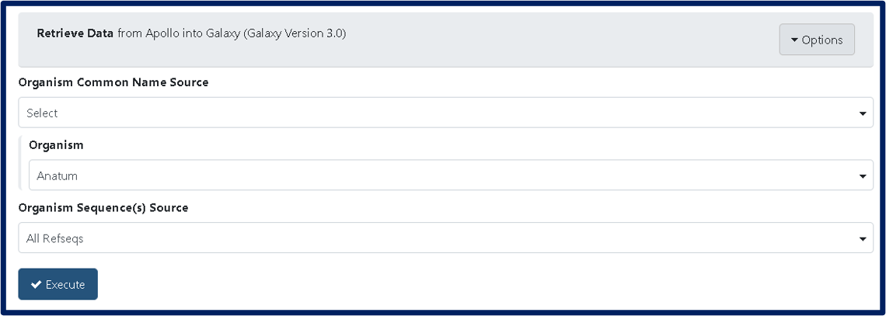
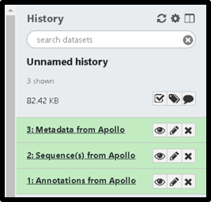
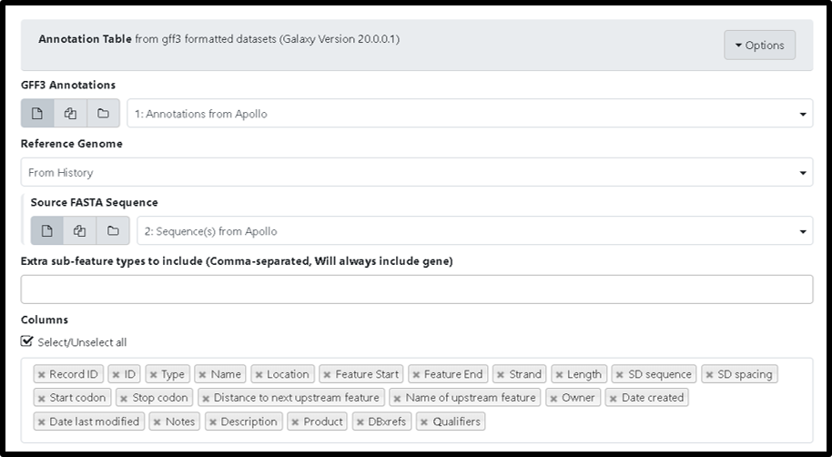
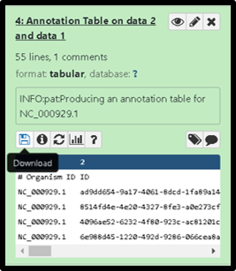

> ### Agenda
>
> 1. Making the Annotation Table in Galaxy
>
> 2. Uses for the Genome Annotation Table
> 
>
{: .agenda}

This tutorial covers the generation of a table that can be saved and edited externally from the annotations of an organism in Apollo. If you have GFF3 formatted annotations, skip to step 1B. See section 2 for various uses of the table. 

# Making the Annotation Table in Galaxy

1A. First you will need to export sequence data and annotations of the desired phage from Apollo. Begin by running the [Retrieve Data from Apollo into Galaxy](https://cpt.tamu.edu/galaxy-pub/root?tool_id=edu.tamu.cpt2.webapollo.export) tool. Use the **Organism** drop-down menu to select the desired phage then click "Execute." 

Once completed, three output datasets will be in your history named Annotations from Apollo (gff3), Sequence(s) from Apollo (FASTA), and Metadata from Apollo (json).

1B. Next, run the [Phage Annotation Table Tool](https://cpt.tamu.edu/galaxy/root?tool_id=edu.tamu.cpt2.phage.annotation_table). This tool creates an annotation Table from gff3 formatted datasets. Run the tool by using the retrieved data from Apollo as input and selecting tabular table as the report format output then click "Execute."

> ###  Note that...
> The "GAF Data" is an optional part of the Phage Annotation Table Tool and can be left blank.
{: .tip}

1C. Upon completion of the Phage Annotation Table tool,  you will download the annotation table to your local machine by clicking on the save/download icon in the expanded dataset view within the history. 

Finally, open the downloaded genome annotation table file in a spreadsheet to easily browse the data, see below for notes.

# Uses for the Genome Annotation Table

Once you have opened the genome annotation table in a spreadsheet. The annotation table can be used for viewing all names and notes associated with features in an Apollo record. 

The annotation table can also help you organize your thoughts, impressions, and notes relevant to consider when trying to decide on a final name. They are all right next to each other if opened in an excel-type spreadsheet. It also reduces all the clicking required to simply view notes for any feature in Apollo. 

Using the annotation table as a temporary holding place for names and notes is fine as viewing these next to each other can be convenient. However, notes that should be included in the final annotation will need to be transferred later to the Apollo record, or another place like the Genbank file. 

> ###  Remember...
> This is a snapshot in time and does not update when things are changed in Apollo. The annotation table can be generated again at any time.
{: .tip}

> ###  Note that...
> There is now a tool which can apply notes added to a tabular file back into the gff3, [here](https://cpt.tamu.edu/galaxy-pub/root?tool_id=edu.tamu.cpt2.gff3.gff3_table_annotations). 
{: .tip}

