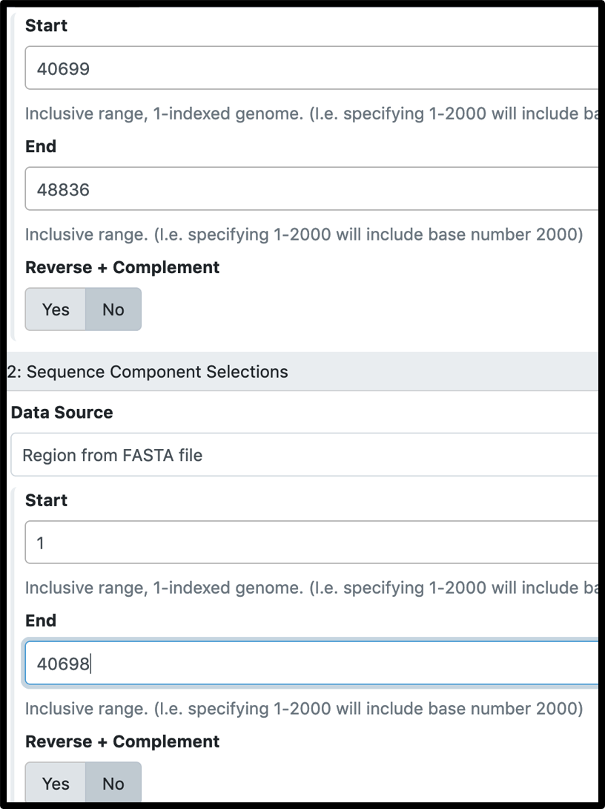

# Reopening an Existing Apollo Record with Annotations

This tutorial is used to...

> ### Agenda
>
> In this tutorial, we will deal with:
>
> 1. Import Apollo data into Galaxy
> 2. Concatenate the Genome
> 3. Re-upload Organism into Apollo
>
{: .agenda}

# Import Apollo data into Galaxy

Import Apollo data into Galaxy using the [Retrieve Data](https://cpt.tamu.edu/galaxy/root?tool_id=edu.tamu.cpt2.webapollo.export) tool. You will get three files from this step (FASTA, GFF3, Json).  

# Concatenate the Genome

Then, use the [Genome Editor](https://cpt.tamu.edu/galaxy/root?tool_id=edu.tamu.cpt.gff3.genome_editor) tool in galaxy to concatenate the genome appropriately, deleting the unnecessary sequence, adding missing sequence, or re-opening at the appropriate position.  

You need to input the GFF3 and FASTA data you retrieved from Apollo, and click on “Insert sequence component selections” and concatenate them together. You need to fill in a new ID name for the edited genome (like Phage.v2). 

If you add missing sequences, please note that new gene calls may be needed at the newly added region.  You will lose any annotation that is split by reopening.

# Re-upload Organism into Apollo

After the organism is edited/reopened, import and run the “Upload Previously Annotated Sequence to Apollo (v2020.01)” workflow in [Published workflows](https://cpt.tamu.edu/galaxy/workflows/list_published) to upload and view the new Apollo record.  

> ###  Note that…
> This creates a new organism, which you must give a new name (like Phage.v2) . Check the features in the re-opened genome to ensure accuracy.  You may need to re-run structural and functional workflow for the re-opened genome to add annotation tracks to the new Apollo record, and to fix gene calls and annotations, especially for the edited regions.
{: .tip}
