> ### Agenda
> * Genome Closure
>    > * Confirmation PCR
>    > * Closure PCR
>    >    > * Background
>    > * Trimming
>    > * Renaming
>
> * Contig Re-Opening
>    > * Deciding Where to Re-Open
>    >    > * BLASTn Analysis
>    >    > * PhageTerm Analysis
>    > * Re-Opening in Galaxy
> {:toc}
>
{: .agenda}

# Genome Closure

This protocol is expected to be useful after a phage genome has been sequenced and the reads are assembled into a contig, see the [Assembling Genome from Sequencing reads tutorial]({{ site.baseurl }}//topics/de-novo-assembly/tutorials/assembling-genome-sequences/tutorial.html). The assembly results from a sequencing run will include a long list of ‘nodes’. These are raw contigs that were assembled from the reads in that sequencing index. Based on the estimated or known sizes of the input genomes, the sequencing coverage for the assembled contigs,  and the preliminary BLAST results using the contig sequences, it is often possible to accurately match a specific node sequence to an input phage gDNA (or other input DNA). Definitive matching requires an experimental approach called **confirmation PCR**, where primers are designed based off the raw contig sequence, then the primers are used to amplify the expected sequence using the matching input gDNA as template. An amplicon of the correct size is the best verification that the raw contig represents the genome of the phage to which the genomic DNA is associated with.

After confirming that the assembled conitg represents a particular phage genome, the next step is to verify that all the bases of the actual genome are accounted for in the assembed sequence, an approach called **genome closure**. Genome closure is usually accomplished by the sequencing of PCR products amplified from the phage genomic DNA acrossing the contig ends, or by sequencing directly off the ends of the phage genomic DNA. The success of this procedure is dependent on the the mechanism by which the phage packages its DNA into the capsid, and the resulting termini of the genome. 

Phages like T4, T1, P1 or P22 do **pac type packaging** and thus the phage genomic DNA is both terminally redundant and circularly permuted.  This means that there is no single true end coordinate for the genome, as each individual packaged phage chromosome will start and end at a different position. Because of this, primers designed facing away from each other off the ends of the assembled contig should produce a product that can be sequenced to ensure that no bases are missing from your genome.

Phages like T7, T5 or SPO1 are terminally redundant but *not* permuted, and thus have **terminal direct repeats** at the ends of the genome; these repeats can be short (~100-300 bp, as in T7) or long (several kb, as in T5).  Although every packaged phage chromosome starts and stops at the same position, the the two repeats are usually collapsed into the middle of the contig by the assembler because no individual k-mer is long enough to span the entire repeat.  Becasue of this, the assemblies of terminal repeat phages are typically opened at a random position with the two identical repeat regions collapsed into a single region somewhere in the middle of the contig.  These phages will appear to be permuted like a pac type phage.  Unless you are very unlucky and the contig is opened by the assembler at or near the actual terminal repeats, the closure PCR should using primers facing off the ends of the contig *should* work.

The genomes of phages that package their DNA by **cos type packaging**, like lambda or P2, have no terminal redundancy and are not permuted, so each packaged phage chromosome has the same ends, which typically have short (~10-20 bp) single-stranded overhangs. If the assembler opened the phage contig at its cos ends, PCR will not work for this phage type in theory. Instead, the end sequence will need to be determined experimentally via direct sequencing (sequencing off the end using genomic DNA as template), and/or ligation of the genomic DNA then PCR and sequencing the ligated region. In practice, we have observed that a PCR product can sometimes be obtained across the cos ends for these phage as well, even though they should not theoretically be amplified by closure PCR.

> ###  A Useful Reference
> [Software-based analysis of bacteriophage genomes, physical ends, and packaging strategies. BMC Genomics. 2016 Aug 26](https://bmcgenomics.biomedcentral.com/articles/10.1186/s12864-016-3018-2) [PMID: 27561606](https://www.ncbi.nlm.nih.gov/pubmed/?term=27561606)
{: .comment}

## Confirmation PCR

Begin by retrieving the sequence from the contig (node) that putatively matches to the phage genomic DNA. 
> * The contig FASTA file will be present in the Galaxy history where the phage assembly was performed. Extract the contig of interest from the assemled contig pool
>    > * If you assembled the genome, locate the history in which it was assembled.
>    > * If someone else assembled it and shared the assemply results with you, look under "Histories shared with me", and import the history.

Design confirmation PCR primers off the contig sequence. This primer pair can be designed manually, or with any primer design software. The instruction below uses the [IDT PrimerQuest Tool](https://www.idtdna.com/site/account/login?returnurl=%2FPrimerquest%2FHome%2FIndex), since it is very flexible and does automated design of high-quality primer pairs.
> * Navigate to the [IDT PrimerQuest Tool.](https://www.idtdna.com/site/account/login?returnurl=%2FPrimerquest%2FHome%2FIndex) Under the Tools drop-down menu, open the "Show Custom Design Parameters" tab.

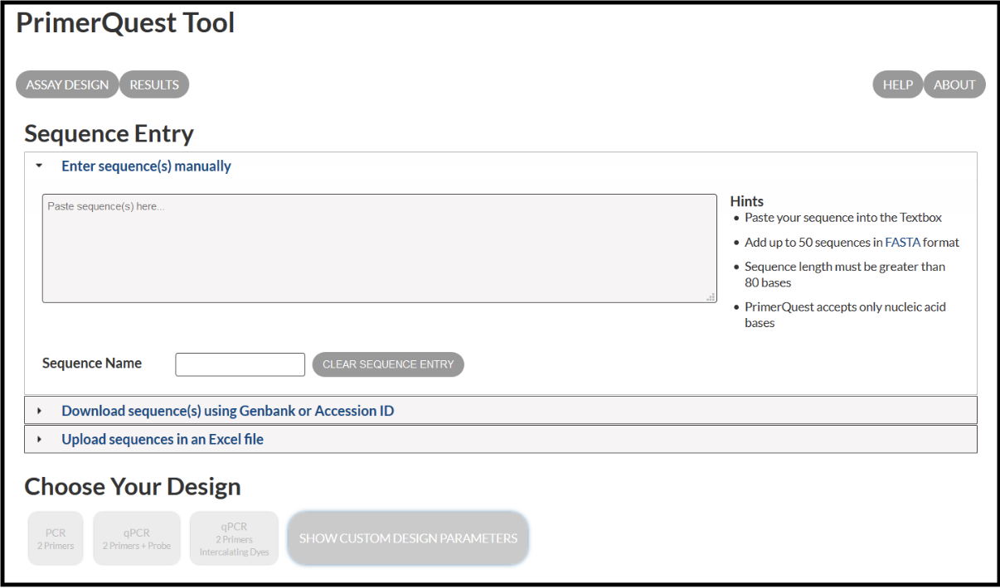

> * Set the design parameters to "General PCR (primers only)" in the Custom Design section and enter the following parameters:

> * Copy a large portion of the sequence from the middle of the genome (scroll to the approximate center, highlight some ~5000 bases) and paste it into the “*Paste Sequence(s) here*” textbox in the primer design tool.
> * Press the "*Get Assays*" button at the bottom of the screen.
> * Parse through the presented primer pair options and choose one option to order. For example:

> * Be sure to record the option that you have chosen to order and make a note in your sequence file where the expected amplicon and primers are located. A good formatting suggestion is shown here, where the highlighted regions represent where primers would bind and the underlined region is the expected amplicon:

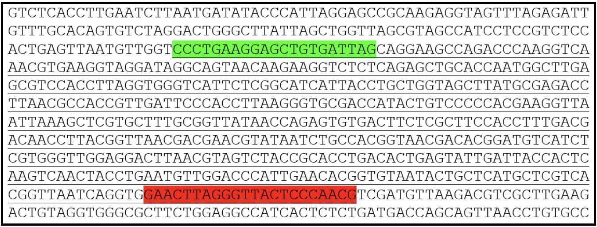

Set up a PCR reaction with new confirmation primers as follows:
> * Dilute new primers by resuspending the lyophilized product in pure water after a brief centrifugation. Prepare a 100 uM stock, and a 10 uM working stock.
> * Assemble the PCR reaction with the following agents, which can be scaled up as needed.

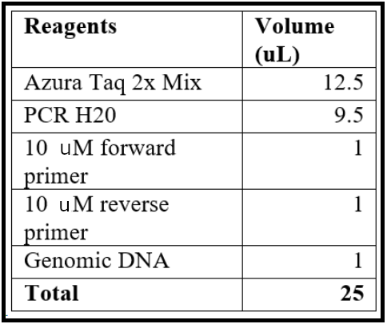

> * Run the PCR reaction with the following conditions:

Visualize the PCR product on a 1% agarose gel using a visualizing agent, such as ethidium bromide or SYBR Safe.
> * Mix loading dye with the PCR product at the appropriate concentrations (5 uL of product with 1 uL of 6X loading dye). Also load a 100 bp ladder and perform electrophoresis at 100 constant Volts.
> * Image the gel after approximately 45-60 minutes. Record whether the product sizes match the expected length.
> * Save the results. Upload the properly labeled images to an appropriate storage location (such as a shared Google Drive folder).

If a confirmation product of the expected size is identified, congratulations! This contig represents the genome of the phage to which the genomic DNA is associated with, and you may proceed to the closure PCR stage. 
> * If the confirmation PCR result is unexpected, see the troubleshooting section below.

## Closure PCR

Return to the FASTA file for the confirmed node (*Raw_phagename*). Design a set of primers that amplifies 500-700 bp product across the ends. If using the [IDT PrimerQuest Tool](https://www.idtdna.com/site/account/login?returnurl=%2FPrimerquest%2FHome%2FIndex), follow the guidelines given above, with the following modifications.
> * Set the design parameters to “General PCR (primers only)" in the Custom Design section and enter the following parameters:

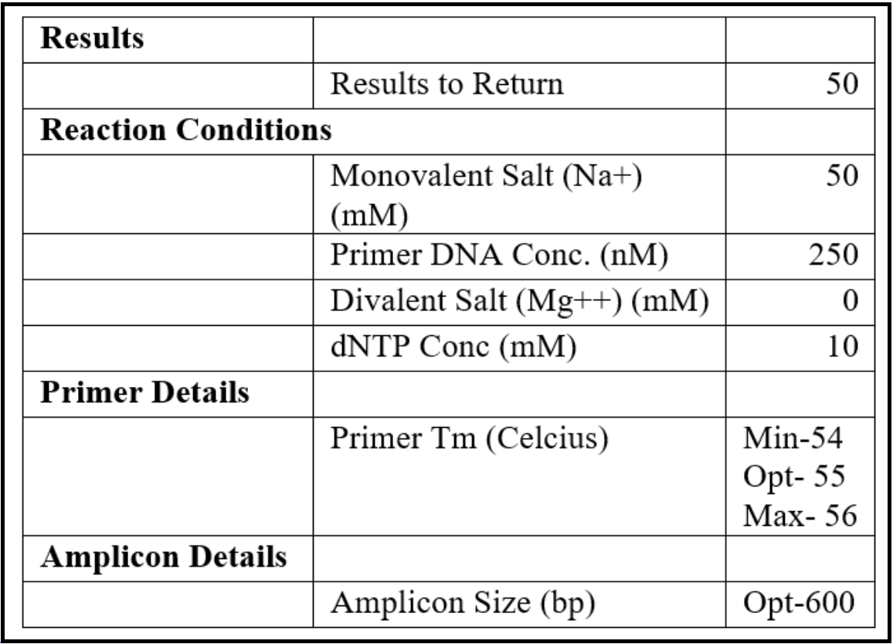

> * From the genome saved in the word processor, copy and paste approximately the last 500 bases from the 3’ end and paste into the “*Paste Sequence(s) here*” textbox. Then copy approximately the first 500 bases from the 5’ end and paste it below the earlier sequence (closure PCR should span from the 3’ to the 5’ end).
> * From the list given, pick the primer pair which approximately covers the regions connecting 300 bp from the 3’ end and  300 bp from the 5’ end.
> * Verify that hairpin loops will not form in your PCR conditions (see below) using  IDT analyzing tools before checkout.
> * Order those primers using the naming convention: *TwoInitials PhageName close for/rev* (for example: TM Maine close For, TM Maine close Rev).
> * For the records, highlight the amplicon and primer sequences in the genome.

Set up a PCR reaction with the new closure primers as follows.
> * Dilute new primers by resuspending the lyophilized product in pure water after a brief centrifugation. Prepare a 100 uM (1 nmol= 10 uL H20) stock, and a 10 uM working stock.
> * Assemble the PCR reaction as for the confirmation reaction above.
> * Run the reaction with the following conditions:

Visualize and record the gel results as described above.
> * If an amplicon is identified, send the PCR product for sequencing.
> * If no amplicon is observed, proceed with the troubleshooting options below.

Send the PCR product for Sanger sequencing.
> * At the [CPT](https://cpt.tamu.edu/), we use the services of [EtonBioscience](https://www.etonbio.com/). Log in using the lab credentials and place an order for unpurified PCR product sequencing with local pick up.

> * Fill in the sample information and record the order number.
> * Prepare 10 uL of unpurified PCR sample, and 8 uL of the respective forward and reverse primers (two sequencing reactions will be performed for every PCR product).
> * Label the samples and drop them off in the pick up box.

Analyze the sequencing results to verify the genome end sequence.
> * When Sanger sequencing results become available, inspect the quality reports and raw chromatograms.
>    > * For poor sequencing results, request that the company rerun the reactions. For repeated poor sequencing, consult with supervisor for direction.
>    > * For high-quality and long reads, continue with the analysis.
> * Download the appropriate .ab1 files and open them with a sequence analysis program like [ApE](http://jorgensen.biology.utah.edu/wayned/ape/).
> * Inspect the contig sequence alongside the sequencing chromatogram. This can be performed manually (see below), or by an alignment within [ApE](http://jorgensen.biology.utah.edu/wayned/ape/).

> * From the genome saved in the word processor, copy and paste approximately the last 500 bases from the 3’ end and the first 500 bases from the 5’ end into a new DNA file in [ApE](http://jorgensen.biology.utah.edu/wayned/ape/). This now should contain the entire expected closure PCR product sequence. Open the .ab1 file and align the two sequences. Look for large regions of broken alignment, as shown here where there are extra bases in the raw node DNA (top sequence line) not present in the actual sequence data (bottom sequence line).

> * A genome with no corrections needed will have an alignment that looks more like this:

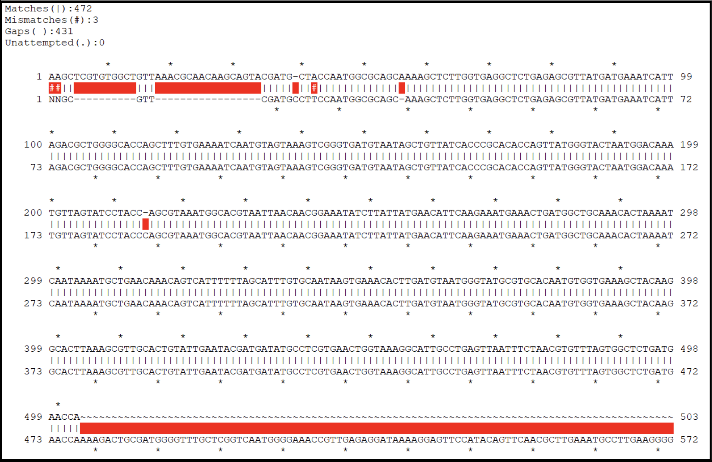

> * Take notes of base pair changes and duplicated portions of the genome. Note that sequencing results are noisy at the 5’ and 3’ ends, which is why both the forward and reverse reactions results should be consulted only in the regions where the signal is high and of good quality.
> * Record errors or inconsistencies (duplicated or extra sequence).
>    > * An error-free sequence file can be generated where these node mistakes are corrected to align with the sequencing data. ,This document is optional, as trimming will be performed in Galaxy, but it can be helpful for tracking the changes made. Title the error-free sequence *Closed_phagename* and save with the other files.
>    > * If there is continuous coverage over the entire 3’ → 5’ region with no mistakes, rename the original raw file to indicate that it is the closed genome sequence: *Closed_phagename*.

## Trimming/Renaming Genome Nodes

If no sequence needs to be removed, proceed to "Rename the FASTA file..." in this section. If your phage sequence needs to be altered, by removing bases at one end or the other of the genome, proceed with the following:

In CPT Galaxy, locate the phage genome FASTA file-containing history.
> * If you assembled the genome, locate the history in which it was assembled.
> * If someone else assembled it, look under ‘histories shared with me’, and import the history.

For trimming, reformat the sequence in the FASTA file so that all the bases are on one line. Do this by opening the [FASTA Width](https://cpt.tamu.edu/galaxy/root?tool_id=toolshed.g2.bx.psu.edu/repos/devteam/fasta_formatter/cshl_fasta_formatter/1.0.0) formatter tool, use your contig FASTA file as input, and enter 0 for the “New width for nucleotide strings” field. Run the tool.

To trim bases from the sequence, open the [Trim](https://cpt.tamu.edu/galaxy/root?tool_id=trimmer) tool and set the parameters according to the modifications needed.

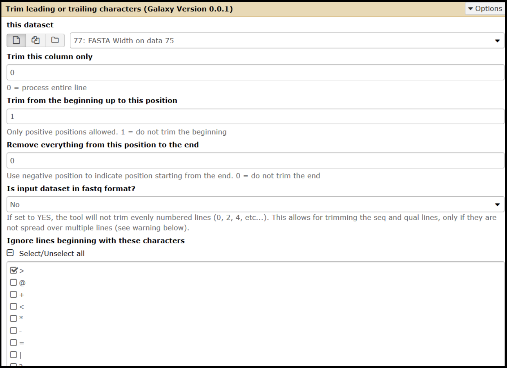

> * Select the input as your [FASTA Width-formatted](https://cpt.tamu.edu/galaxy/root?tool_id=toolshed.g2.bx.psu.edu/repos/devteam/fasta_formatter/cshl_fasta_formatter/1.0.0) dataset.
> * **To trim from the 3' end:**
>    > * Set the "*Trim from the beginning*" value to 1.
>    > * Change the "*remove everything from this position to the end value*" parameter to the number of bases that you want to remove. Enter the value as a negative (ex: removing 55 nucleotides, enter as -55).
> * **To trim from the 5' end:**
>    > * Set the “*Trim from beginning*” value to the number of bases you wish to remove, plus one (ex: removing 55 nucleotides, you would enter 56).
>    > * Set the “*Remove everything from this position to the end value*” to 0.
> * Ignore lines beginning with > (greater than) character.

Verify that the correct number of nucleotides have been trimmed by visual inspection of the sequence.

Reformat the FASTA file into standard width by using the [FASTA Width formatter](https://cpt.tamu.edu/galaxy/root?tool_id=toolshed.g2.bx.psu.edu/repos/devteam/fasta_formatter/cshl_fasta_formatter/1.0.0) tool.
> * Set the “New width for nucleotide strings” value as 60 and run.

Verify that the trimming worked by using the [Compute Sequence Length](https://cpt.tamu.edu/galaxy/root?tool_id=toolshed.g2.bx.psu.edu/repos/devteam/fasta_compute_length/fasta_compute_length/1.0.0) tool.
> * Select the reformatted FASTA file as input.
> * Leave the title characters to keep setting as 0.
> * The value returned should match your calculated length (original length - trimmed bases = new length).

To rename the sequence ID in the header of the FASTA file, open the [Fasta Sequence Renamer](https://cpt.tamu.edu/galaxy/root?tool_id=edu.tamu.cpt.fasta.rename) tool. Enter “*PhageName_Closed*” as the new name. For example: *Minorna_Closed*

> ###  Note that...
> You may wish to collect an entire set of closed genomes (such as a group of phage that will be used for a class) into one history.
{: .comment}

In each history used for this process, add tags for each phage genome with datasets manipulated in the history. Do this for the history where the phage was assembled (usually titled by the index from the sequencing run), and for the history where it was closed. Tags and history names are *searchable* in Galaxy, therefore this step is **critical in the documenting process** so that all data can be easily retrieved across the years and between researchers.

In each history used for this process, add a detailed annotation. Include aspects such as when phage genomes where originally collected, sequenced, and who owns them (or which class they will be in).

## Troubleshooting

#### Confirmation PCR

**Problem**: No amplicon on your confirmation PCR gel.

**Potential solutions**:
> * Verify that the genomic DNA is high quality. Check its approximate size (or at least that it is a single band) and concentration by running it on an agarose gel.
> * Review the primer design to ensure that the region would have been amplified without major issue (re-check for hairpin secondary structures forming). Ensure Tm used is optimal for primer pair.
> * Re-run PCR, modifying the reaction conditions. Increase extension time or lower the Tm.
> * If another genome assembled from the index is having similar issues, try switching the templates. We may have guessed the wrong node for a particular phage.
> * Consult with supervisor for additional advice.

#### Closure PCR

**Problem**: No amplicon on your closure PCR gel.

**Potential solutions**:
> * Re-run PCR, modifying the reaction conditions. Increase extension time (in case we are missing a large chunk of sequence). 
> * Use results from [Phageterm](https://cpt.tamu.edu/galaxy/root?tool_id=PhageTerm) to determine if the predicted phage termini make closure difficult or impossible. Some phages, like the small Staphylococcus podophages (~20 kb), have covalently attached proteins at the end of the genome. The only way to overcome this is to perform enzymatic degradation of the attached protein prior to PCR. Usually, this is not necessary (it is a time-consuming procedure and few bases are corrected in the genome), and the genome can be annotated as is.

**Problem**: Multiple amplicons on your closure PCR gel.

**Potential solutons**:
> * If you observe double bands, gel purify each of the individual bands and send them off for sequencing (this will require using a higher percentage agarose gel as well as running it for a longer amount of time at a lower voltage).

**Problem**: Unexpected amplicon size on your closure PCR gel

**Potential solutions**:
> * Send the reaction for sequencing anyways, the assembled node sequence may not reflect the actual genomic sequence.

**Problem**: Poor sequencing results.

**Potential solutions**:
> * Low quality sequencing may be a result of company handling. Ask them to rerun the reactions (usually, this is done for free without need to resend primers/pcr products).
> * Send higher quality (or amount) of fresh template for sequencing.

# Contig Re-Opening

In the final deposited phage genome, base 1 should be in a logical place. The convention is to follow the accepted standard in the field. We try to make it mostly syntenic with genomes already in the database. If your phage is similar to another genome in the database, best-practice will open your genome in the same place. It should not be in the middle of a feature (especially genes). Sometimes, there is no precedent, or the precedent might not make sense in light of published data, in which case, a different course can be taken.

For your phage genome, re-opening will likely need to take place. Many researchers will save this for the last step, or penultimate step, after gene calling and similarity analyses have been determined through the annotation process. In some cases, such as the undergraduate teaching setting, it may be desirable to re-open the genome prior to annotation. Below are described the considerations that might be taken into account when:

1) deciding where to re-open an unannotated genome, and
2) understanding the mechanics of re-opening a genome in Galaxy.

## Deciding Where to Re-Open

After contigs are closed, the closed contigs should be re-opened properly according to their genome types. Without annotating and analyzing the entire genome, the genome type of a given contig could be predicted by running:

> * BLASTn against the NCBI nr database
> * PhageTerm, a software package that uses raw reads and its genomic reference sequence to predict the termini positions. *It is worth noting that such prediction is not always successful or accurate*.

### BLASTn Analysis

Running BLASTn using your genome sequence against the nr database serves two purposes: to get a quick idea on the **orientation** or your genome sequence, and to get an idea on the  **phage type** by looking at the related phages in GenBank. For immediate results, use the public NCBI web-based BLAST page. To save results for the future reference, do the Galaxy procedure.

**_Procedure_** for running [BLASTn at the NCBI public site](https://blast.ncbi.nlm.nih.gov/Blast.cgi?PROGRAM=blastn&PAGE_TYPE=BlastSearch&BLAST_SPEC=&LINK_LOC=blasttab&LAST_PAGE=blastp), and on Galaxy with the [NCBI BLAST + blastn tool](https://cpt.tamu.edu/galaxy/root?tool_id=toolshed.g2.bx.psu.edu/repos/devteam/ncbi_blast_plus/ncbi_blastn_wrapper/0.1.01). If this was already done in the [Assembling Genome Sequences tutorial]({{ site.baseurl }}//topics/de-novo-assembly/tutorials/assembling-genome-sequences/tutorial.html) tutorial, then this section can be skipped.

**_NCBI BLASTn_**
> 1. Copy the entire closed contig sequence into the query sequence box. Usually default parameters for megablast against nr is sufficient.
> 2. Run BLAST
> 3. Sort through hits and their alignments for the information below.

**_GALAXY BLASTn_**
> 1. Doing the BLAST in Galaxy will yield a permanent link that can be stored for reference. In the appropriate history with the closed contig FASTA file, open the [NCBI BLAST + blastn tool](https://cpt.tamu.edu/galaxy/root?tool_id=toolshed.g2.bx.psu.edu/repos/devteam/ncbi_blast_plus/ncbi_blastn_wrapper/0.1.01). Choose the output as BLAST XML (which requires later  with the latest nt database.
> 2.  Choose the output as BLAST XML (later, the [blast2html](https://cpt.tamu.edu/galaxy/root?tool_id=toolshed.g2.bx.psu.edu/repos/jankanis/blast2html/blast2html/0.0.14) tool must be used to convert to html) or html. After the result is ready, right-click on the eye  icon and choose "open in a new tab." The hyperlink can be copied and subsequently shared with other researchers or pasted into a tracking sheet where confirmation and closure information (described above) is compiled.

**Orientation:**
After running BLASTn, check the alignments to the top closest hits. If the top 2-3 genome hits are correctly oriented (most genes are coded on the plus strand), and your genome shows the same orientation, you do not need to reverse complement your sequence. When the top hits are ambiguous, or the annotation to that genome is not high-quality and it may therefore have been deposited incorrectly, then that example should not be followed. When it appears the top quality hits are oriented in the opposite direction, you need to reverse-complement your FASTA sequence before re-opening it.

For phage with direct terminal repeats, when Phageterm outputs high-confidence boundaries and reverse-complementing is not needed, then open the genome at the first base in the boundaries (it is an inclusive number) (see directions below). If a reverse-complement is necessary:
1) do the reverse-complement, re-run Phageterm (or do math), then check the boundary number and re-open (using directions below) 
or 
2) re-open one base after the left end of the boundary and then reverse-complement (re-run Phageterm to double check the result makes sense).

**Phage type:**
Check the top BLAST hits list. Record the accession #, identity, and coverage information of the top BLAST hit for easy reference. Keep a sharp eye out for phage names that will have papers published about them, the [canonical phages]({{ site.baseurl }}//topics/introduction/tutorials/cpt-canonical-phages-list/tutorial.html). Having a genome like a known phage should inform both your re-opening and entire annotation process. If a well-known/studied phage is not among the BLAST hit list, it may help to check the closest type phage in the NCBI taxonomy or on ICTV (see some help on this in the [Phage Comparative Genomics tutorial]({{ site.baseurl }}//topics/additional-analyses/tutorials/phage-comparative-genomics/tutorial.html)). **Use this strategy with caution.** Phage taxonomy is in a state of constant flux, so the main point here is to help you find literature that is published on potentially related phage/phage proteins.

If your genome's phage type can be determined, re-open your genome to make it syntenic to the canonical phage in that phage type. See below for the different phage type scenarios.

### PhageTerm Analysis

[PhageTerm](https://www.nature.com/articles/s41598-017-07910-5) [PMID:28811656](https://www.ncbi.nlm.nih.gov/pubmed/?term=28811656) predicts termini and packaging mechanisms using the raw reads of a phage sequenced with technologies that rely on random fragmentation and its genomic reference sequence. While not fully verified, the tool provides a good guide for genomes with well-described end types. Sometimes this prediction is informative when closing a genome (see this Genome Assembly tutorial]({{ site.baseurl }}//topics/de-novo-assembly/tutorials/assembling-genome-sequences/tutorial.html); it can also be useful for deciding where to re-open a genomic sequence. After BLASTn, run [PhageTerm in Galaxy](https://cpt.tamu.edu/galaxy/root?tool_id=PhageTerm) as detailed below.

**_Procedure_**
> * Choose the input files based on which dataset gave the contig for the phage genome. For the FASTQ **mandatory input** use the better set (usually R1). For the **optional input**, use the other dataset (usually R2).
> * Name the output file with the phage name.
> * Execute.
> * When complete, open the output dataset called report.

> ###  A Note on Prediction Agreement
> Generally, we consider an agreement between the two methods in a [PhageTerm](https://cpt.tamu.edu/galaxy/root?tool_id=PhageTerm) report to be a good indication that the prediction is true.
>
> If sequence coverage is low (<10), [PhageTerm](https://cpt.tamu.edu/galaxy/root?tool_id=PhageTerm) results are likely not reliable.
>
> If [PhageTerm](https://cpt.tamu.edu/galaxy/root?tool_id=PhageTerm) fails, try running it with only R1 or R2. Check that you are using the R1/R2 combo or single set that actually gave the final contig, though that may not actually matter.
>
> When the predictions disagree, or the phage is a novel type/not closely related to well-studied phages, it may help to randomly reopen in the middle of the genome and re-run [PhageTerm](https://cpt.tamu.edu/galaxy/root?tool_id=PhageTerm) to give the program a different sequence to analyze. Or, choose one of the more reliable boundary predictions to re-open at, then rerun the program. Agreement between the two methods in the report after this **may** indicate a reliable prediction.
{: .comment}

## Re-Opening Genomes in Galaxy After BLASTn and PhageTerm Analysis

After integrating the information from BLASTn and the [PhageTerm](https://cpt.tamu.edu/galaxy/root?tool_id=PhageTerm) analysis, the following re-opening guidelines can be followed to re-open your genome with the Galaxy [Re-open FASTA sequence](https://cpt.tamu.edu/galaxy/root?tool_id=edu.tamu.cpt.fasta.reopen) tool.
> * In a Galaxy history that has the most up-to-date FASTA sequence for your phage genome, open the tool [Re-open FASTA sequence](https://cpt.tamu.edu/galaxy/root?tool_id=edu.tamu.cpt.fasta.reopen). Select the FASTA sequence for your phage as input, and enter the exact number of the base you want to become base one in the reopened sequence.
>    > * When opening in front of a specific gene with a relatively good alignment, go ~30 bp upstream to not cut off any features of the gene.
>    > * Note that this can be done in a text editor outside galaxy, or in a dedicated sequence manipulation program, but the record of that change is lost (not recorded and therefore not reproducible) and there is a higher chance for mistakes.
> * After the genome has been re-opened, replace the FASTA header with the new phage name (chosen following the guidelines below). 
>    > * In Galaxy, run the [rename tool](https://cpt.tamu.edu/galaxy/root?tool_id=edu.tamu.cpt.seq.rename), which adds a new header name to the FASTA file but still appends the old name at the end. 
>    > * Remove the old name by running the [Remove Description](https://cpt.tamu.edu/galaxy/root?tool_id=edu.tamu.cpt.fasta.remove_desc) tool, which deletes everything after the first space on the first line of the FASTA file.
>    > * This can be done by downloading the sequence, manually typing in the new header, saving and re-uploading. Not the preferred method as the record of how changes were made is not maintained in Galaxy.

> ###  How should I name the phage?
>    > ### 
>    > Before this phage was sequenced, it should have been imaged by TEM. At that time, most isolators will name their phage. The CPT convention has been to use names informative of the morphology for all newly discovered phage. 
>    > * Siphophage names begin with ‘S’.
>    > * Myophage names begin with the letter ‘M’.
>    > * Podophage names start with ‘P’.
>    >
>    > Also, all names should be unique, not already given to a described phage. This should be checked at the [CPT name registry](https://cpt.tamu.edu/phage-registry/), which compiles names from other researchers as well. It is also a good idea to check the [NCBI databases](https://www.ncbi.nlm.nih.gov/search/) to make sure that you aren't choosing a name already used for a protein or other organism in the literature. Note that in the interim between phage discovery and genome deposition into Genbank, a once unique name may be taken. If that is the case, or if it has not been named but the morphology data is available, a new name must be chosen. 
>    >
>    > Before loading the trimmed data into Galaxy, give all files associated with this phage sequence the correct name.  Also, add the appropriate tags to the histories. All manipulations to the contig should receive a variation of the name, e.g. if the original phage genome contig was “Lambda” name the new phage “Lambda.v2” or “Lambda_reopen” and everytime it asks for a name use the same one. The name should not have any spaces in it e.g. “Lambda 2” would not work.
> {: .solution}
{: .question}

### T4-like Genomes

T4-like phages are pac type phages, and there is no actual start site of the genome.  All T4-like genomes should be re-opened to be syntenic to the T4 genome.  This means the genome is opened in between rIIA and rIIB, with rIIA being the first gene on the minus strand, and rIIB being the last gene on the minus strand (see illustration below).

Left end of the T4 genome with rIIA being the first gene:

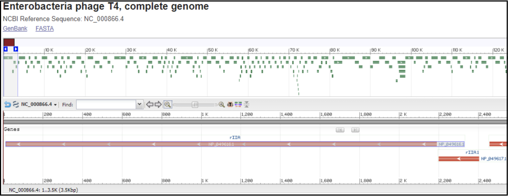

Right end of T4 genome with rIIB being the last gene:

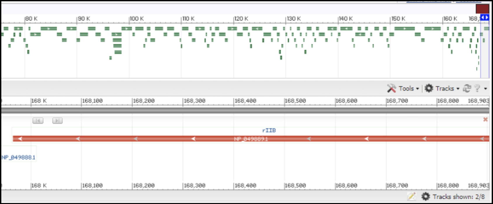

In order to locate the rIIA and rIIB in your genome, you need to [make a protein BLAST database in Galaxy](https://cpt.tamu.edu/galaxy/root?tool_id=toolshed.g2.bx.psu.edu/repos/devteam/ncbi_blast_plus/ncbi_makeblastdb/0.1.01), or use one available in the CPT shared data library, which consists of the protein sequence of rIIA (NP_049616.1) and rIIB (NP_049889).

In Galaxy, go to Shared Data, then Custom Databases folder, then T4 rIIA rIIB databases. Inside, there are databases that can be imported into a history and used to BLAST your genome against.

The next step is to run BLASTx using the FASTA sequence of your genome against the T4 rIIA/rIIB database, using the Galaxy tool [NCBI BLAST+ blastx.](https://cpt.tamu.edu/galaxy/root?tool_id=toolshed.g2.bx.psu.edu/repos/devteam/ncbi_blast_plus/ncbi_blastx_wrapper/0.1.01)  This allows you to determine the predicted rIIA and rIIB boundaries in your genome.  If the boundaries can be determined and there is no overlap between rIIA and rIIB, pick a position several bases after the stop codon of rIIA as the re-open position.  Alternatively, pick a position at least 20-25 bases (just enough to stay away from the RBS) from the start codon of rIIB as the re-open position.  If rIIA and rIIB overlap, find the upstream position closest to the stop codon of the rIIA (but not in the middle of a gene) to use as the re-open position. If there are no rIIA/rIIB homologs identifiable, annotate the genome and reassess.

### T3/T7-like Genomes

T3/T7-like phage have a short terminal repeat (TR).  These type of genomes should be re-opened at the TR boundary position (the left end position) predicted by [PhageTerm](https://cpt.tamu.edu/galaxy/root?tool_id=PhageTerm), assuming the genome orientation is correct. By convention, when opening genomes with a TR, the TR is included in only one copy (even though there are two copies in a packaged phage head), and that copy is at the left end of the linear genome sequence. In this way the RNA polymerase is most likely to be at the beginning of the genome, the DNA maturation protein at the end of the genome, and a non-coding region in between. Typically the TR sequence is in the non-coding region close to RNA polymerase. If [PhageTerm](https://cpt.tamu.edu/galaxy/root?tool_id=PhageTerm) does not give a TR prediction, BLASTn the T3/T7 TR sequence (find it [here](https://www.ncbi.nlm.nih.gov/nuccore/NC_001604.1)) in your genome to find the TR region if your genome is close enough to T3/T7.  The bottom line is to try to open the genome following the T7 genome as close as possible.  

### T5-like Genomes

T5-like genomes have a long TR.  These type of genomes should be re-opened at the TR boundary position (the left end position) predicted by [PhageTerm](https://cpt.tamu.edu/galaxy/root?tool_id=PhageTerm), assuming the genome orientation is correct. By convention, when opening genomes with a TR, the TR is included in only one copy (even though there are two copies in a packaged phage head), and that copy is at the left end of the linear genome sequence.  If [PhageTerm](https://cpt.tamu.edu/galaxy/root?tool_id=PhageTerm) does not predict the exact TR boundary, but the genome is close enough to [T5](https://www.ncbi.nlm.nih.gov/nuccore/AY543070.1) (protein_id="[AAS77048.1](https://www.ncbi.nlm.nih.gov/protein/45774916)), open the genome somewhere upstream of the dmp (the gene coding deoxynucleoside-5'-monophosphatase, protein accession number AAS77048.1), which is the first gene in the T5 genome.  This first gene is usually closely followed by homologs of A1 (protein_id="[AAS77051.1](https://www.ncbi.nlm.nih.gov/protein/45774919)) and A2 (protein_id="[AAS77053.1](https://www.ncbi.nlm.nih.gov/protein/45774921)) of T5.  You can use the CPT shared data library with a T5 first genes database to BLAST (using the Galaxy tool [NCBI BLAST+ blastx.](https://cpt.tamu.edu/galaxy/root?tool_id=toolshed.g2.bx.psu.edu/repos/devteam/ncbi_blast_plus/ncbi_blastx_wrapper/0.1.01)) your genome against as described above. The T5 first databases are in Galaxy, under Shared Data, then in the Custom Databases folder.  Without a predicted TR position, the re-opening of the genome usually takes place after the genome is fully annotated. Full annotation of a T5-like genome typically reveals a long non-coding region, and the long TR is often in this region.  This position association of the TR and the non-coding region can be verified if the TR position can be predicted by [PhageTerm](https://cpt.tamu.edu/galaxy/root?tool_id=PhageTerm).

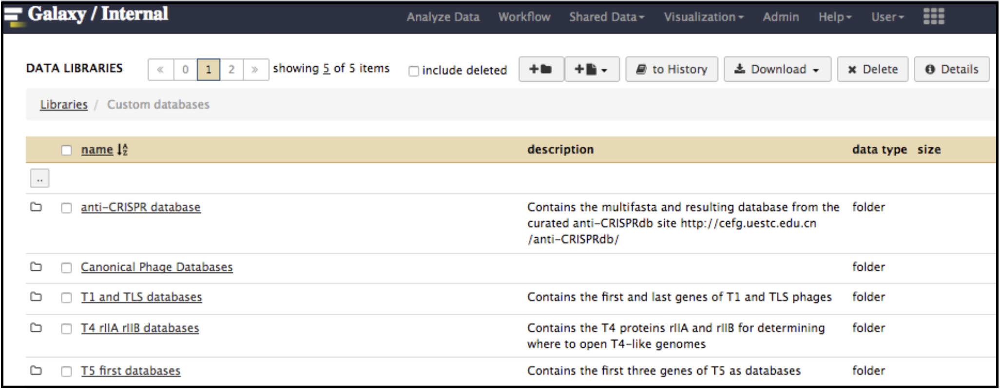

### T1/TLS-like Genomes

T1/TLS-like phages are pac type just like T4, and there is no actual start site of the genome.  Since the T1 genome is deposited backwards (gp1 is the last gene of the genome), we should follow the TLS annotation for re-opening.  T1 and TLS both are opened at the major breakpoint between two groups of genes transcribed in two opposite directions (see illustration below). To follow the TLS phage, the genome should be opened at the *first logical transcription break point upstream of TerS and TerL*.  Upstream genes should be transcribed in the same direction as TerS and TerL, and TerS and TerL should be *on the plus strand*, and *in the middle of the genome*.  For example, the locations of TerS and TerL in TLS (see genome map below) are: **gp29 for TerS and gp30 for TerL**.

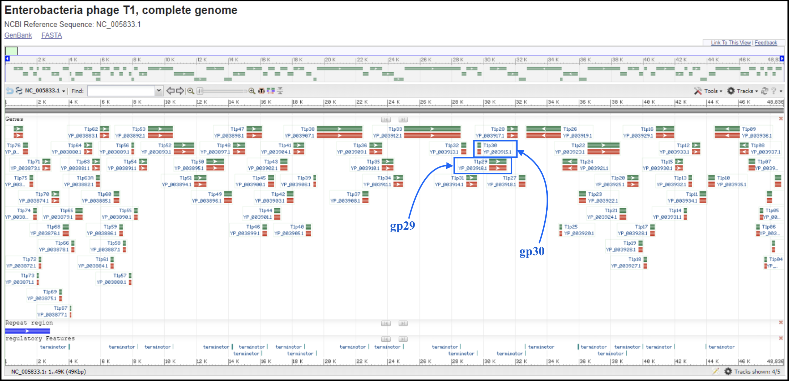

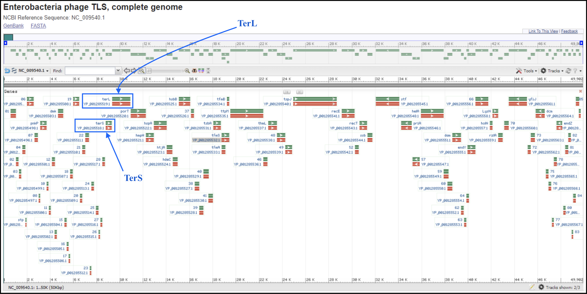

To find the break point without doing full annotation, you can [make a protein BLAST database in Galaxy](https://cpt.tamu.edu/galaxy/root?tool_id=toolshed.g2.bx.psu.edu/repos/devteam/ncbi_blast_plus/ncbi_makeblastdb/0.1.01) (or use the premade databases described below), which consist of the first proteins of T1 and TLS genomes, T1_gp77 (YP_003867.1) and TLS_gp1 (YP_001285490.1), respectively, and the last proteins of T1 and TLS, T1_gp1 (YP_003944.1) and TLS_gp86 (YP_001285576.1), respectively.
In Galaxy, go to Shared Data, then Custom Databases folder, then T1 and TLS databases. Inside there are databases that can be imported into a history and used to BLAST your genome against.

The next step is to run BLASTx using the FASTA sequence of your genome against the protein database you just made, using the Galaxy tool [NCBI BLAST+ blastx](https://cpt.tamu.edu/galaxy/root?tool_id=toolshed.g2.bx.psu.edu/repos/devteam/ncbi_blast_plus/ncbi_blastx_wrapper/0.1.01). This allows you to determine the positions of the beginning and the end proteins, if your genome is close enough to T1/TLS.  If no T1/TLS end protein homologs can be located in your genome, you may run the structural workflow of your genome to pick out the first transcription break point upstream of a patch of larger proteins, and use this position to re-open your genome.

### Ambiguous Types

If the phage type is ambiguous (because it is novel), or a poorly annotated genome that may have been deposited incorrectly, we will not have a convention to follow for re-opening.  Do not make any attempts at re-opening in front of genes. The genome may be re-opened after it is fully annotated.  For example, it may be re-opened in front of TerL (or TerS) if can be identified, and if there is no other obvious choice.  Annotate the genome and reassess.
