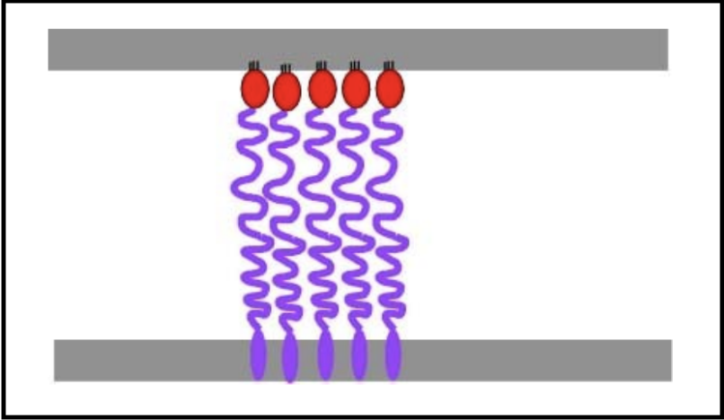
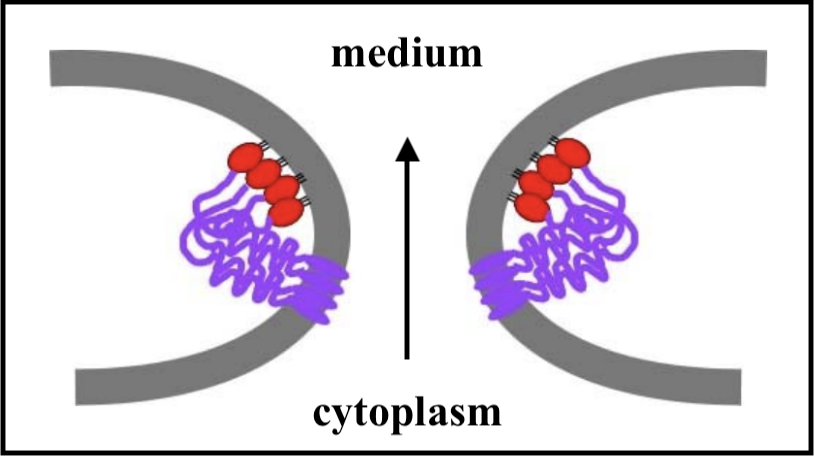
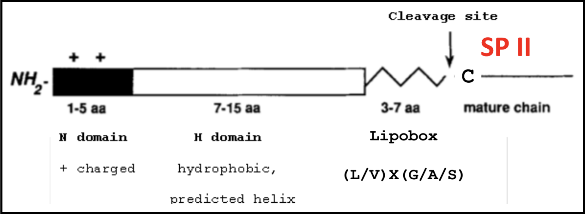

> ### Agenda
>
> 1. A Background on Lysis Genes
>    > * Genes Involved
>    > * Expected Genetic Context
> 2. Finding the Endolysin
>    > * Conserved Domain (InterPro)
>    > * BLAST Hits
>    > * SAR Endolysins
>    > * Types of Endolysins
> 3. Finding Holins and Antiholins
>    > * TMHMM Tracks - Transmembrane Prediction
>    > * BLAST Homology
>    > * Basic Considerations When Looking for Holins
>    > * Annotating Holoin/Antiholin Pairs
> 4. Spanin Genes
>    > * Gram-Negative Hosts
>    > * Spanin Architectures: i-spanin/o-spanin, u-spanin
>    > * What is an SPII signal? What is a lipobox?
> 5. Missing Lysis Genes
> {:toc}
>
{: .agenda}

# A Background on Lysis Genes

> ###  What are the different bacterial cell envelope structures?
>    > ### 
>    > 
> {: .solution}
{: .question}

## Genes Involved

> ###  Gram-positive & Mycolata Bacteria
>
{: .tip}

> ###  U-Spanins
>
{: .comment}

## Expected Genetic Context

> ###  Distributed Lysis Genes
>
> 
>
{: .comment}

# Finding the Endolysin

## Conserved Domain (InterPro)

## BLAST Hits

## SAR Endolysins

## Types of Endolysins

> * **Glycosidase** (T4 E)

> * **Transglycosidase (lambda R)

> * **Amidase** (T7 3.5)

> * Endopeptidase (T5 Lys)

# Finding Holins and Antiholins

## TMHMM Tracks - Transmembrane Prediction

> ###  An Important Note
> If the holin and antiholin are **NOT NEXT TO** the endolysin, then it can only be identified if there is *ONLY ONE* small TMD-containing protein in the entire genome, or via BLAST homology.
{: .tip}

## BLAST Homology

## Basic Considerations When Looking for Holins

> * Holins usually have 1-4 TMDs

> * Holins are small (70 - 220 amino acids)

## Annotating Holin/Antiholin Pairs

# Spanins

## Gram-Negative Hosts

Spanins are only expected in the genomes of phages that infect Gram-negative hosts. From detailed molecular characterization of the lamdba spanins Rz and Rz1, see this [recent review](https://www.ncbi.nlm.nih.gov/pubmed/30635077), and an [in-depth bioinformatic analysis](https://www.ncbi.nlm.nih.gov/pubmed/30219026) of many more spanin sequences, we know what the essential genetic signatures and genomic architectures to expect for spanins in novel genomes. 

## A refresher on SPII signals and lipoboxes

## Spanin systems: two-component and unimolecular

> The two-component spanins encode separate proteins for the spanin subunits. 
> 
> * First, is the inner membrane spanin (**i-spanin**)
>    > * 1 N-terminal TMD
>    > * Small (100-200 amino acids)
>    > * Functionally linked to *o-spanins*
>
> Second is the outer membrane spanin (**o-spanin**)
>    > * N-terminal SPII signal
>    > * 1 N-terminal lipobox
>    > * Genetically starts completely/partially embedded or just downstream of the i-spanin (see below)

> ###  An Important Note on Spanin Annotation
> The i-spanin is **never** embedded in the o-spanin.
{: .comment}

> Alternatively, some phages encode a single protein with the characteristics of both the i- and o-spanins, called the unimolecular spanin (u-spanin). 
> * u-spanin
>    > * 1 N-terminal SPII signal
>    > * 1 C-terminal TMD 
>
## Spanin Two-component gene architectures: embedded, overlapping, and separate

While the u-spanin should be easy to identify based on its genetic signatures colocalized within one coding region, the two-component spanins present a more varied architecture, an important factor in their identification. While the spanins can exist in a typical side-by-side genetic context, some spanin cassettes are instead present as overlapping, or even embedded genes. This is relatively rare, and actually can help in spanin identification. 

# Missing Lysis Genes

 a. **No similarity** - If your phage's genes have no conservation at the protein level, either of domains, amino acids, or genetic architecture, high-confidence predictions for the lysis genes cannot be made. Experiments (or better information in a future iteration of our databases) may be required to predict the phage lysis genes.
 >
 b. **New types/topologies** - Do not fret if your phage genome does not contain any genes with signatures of known lysis genes! This could mean that your phage uses proteins with topologies outside our known paradigms, or a completely novel mechanism.
 >
 c. **Not in a cassette** - Not all phage cluster their genes in cassettes. When this is the case, *and* your phage genome has more than one protein with the signatures of holins/antiholins (TMDs), it is not possible to predict with certainty many of the lysis genes. 
>
The take-home principle is: without reasonable evidence for predicting a lysis function, lysis gene annotations should not be made.
