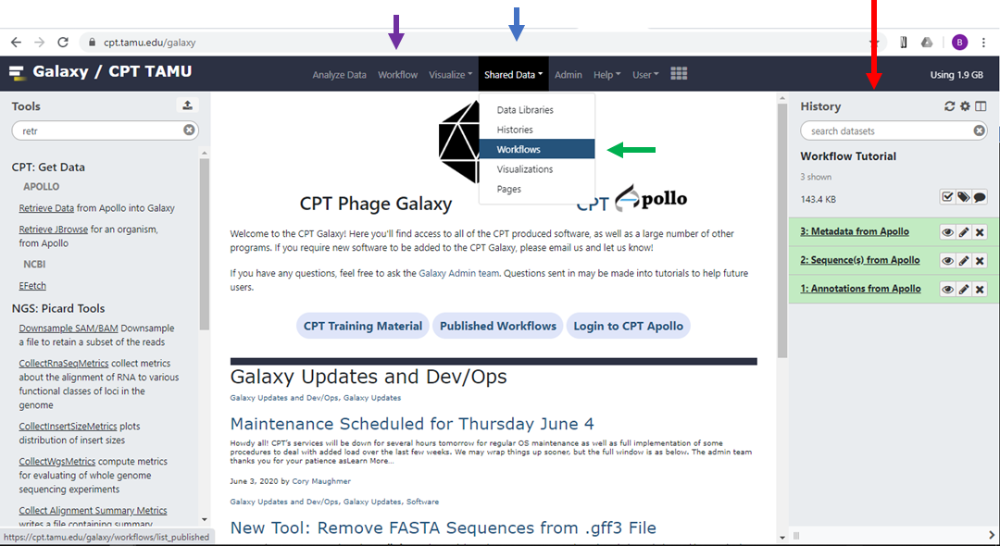
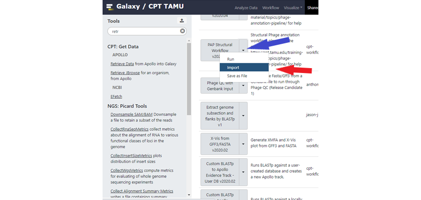
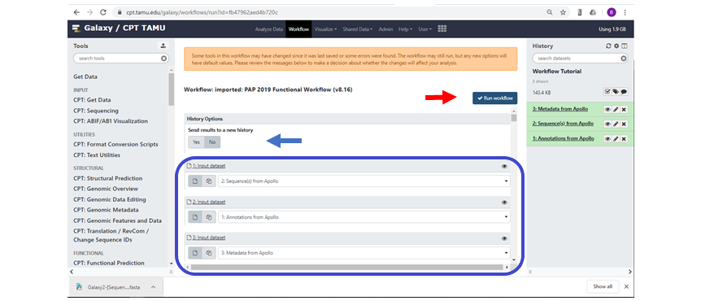
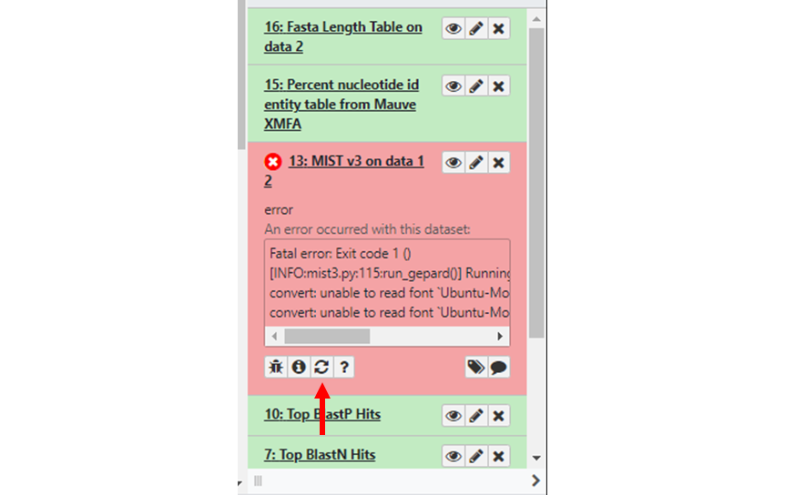
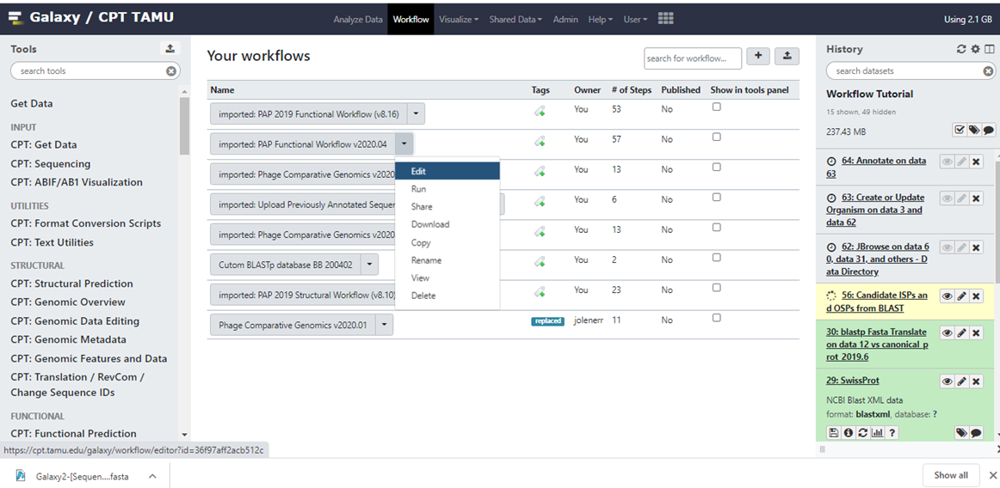
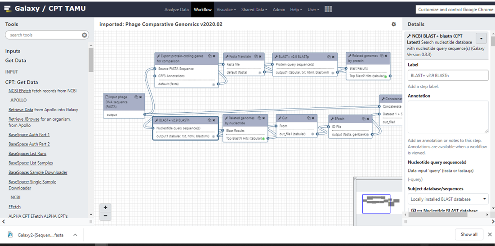
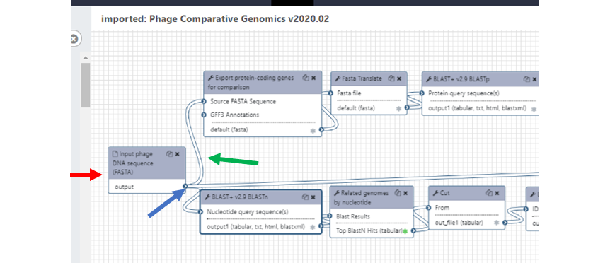

# How to use and Edit Workflows in Galaxy

This tutorial will give you the basics for working with and editing workflows in Galaxy.

> ### Agenda
>
> 1. Prerequisites
> 2. Workflows
> 3. Getting started
> 4. Using workflows
> 5. Editing workflows
>
{: .agenda}

# Prerequisites 
> ###  Are you ready?
> This module assumes you have already completed the following tutorials:
>
> [**Introduction to CPT Galaxy**](https://cpt.tamu.edu/training-material/topics/introduction/tutorials/introduction-to-cpt-galaxy/tutorial.html)
>
> [**Getting Started with Apollo**](https://cpt.tamu.edu/training-material/topics/introduction/tutorials/getting-started-with-apollo/tutorial.html).
{: .hands_on}

# Workflows

Workflows are a means of chaining individual tools together in Galaxy to automatically carry out analyses requiring multiple tools to run in a defined order. As such, workflows enable complex computational analyses to be carried out repeatably and with minimal user input.

Each tool is essentially a discreet algorithm with a defined input requirement (such as a FASTA file) used to generate an output (such as the genome size in bp, extracted from the FASTA file). 

When chaining tools into a workflow it is critical to ensure that each tool has the correct input type and that the output(s) are directed to the next tool in the correct order to carry out the desired objective. For example, if a tool requires a FASTA input then it will fail if a gff3 file is inputted instead. 

Workflows also allow tools to run in parallel because the output of any tool can be sent to multiple downstream tools simultaneously. 

For phage genomic analysis, the CPT has already created and tested workflows for the most common analyses such as structural and functional annotation workflows that identify prospective ORFs (structural) and compare those ORFS to various databases and algorithms to identify their function and relatedness to other genes in various databases (functional).

# Getting started
First, you must have an active account in Galaxy. For TAMU users, navigate to [**CPT TAMU Galaxy**](https://cpt.tamu.edu/galaxy) and log in with your NetID. For external users, navigate to [**CPT Galaxy Public**](https://cpt.tamu.edu/galaxy-pub). You should be presented with the main Galaxy page and an empty history.

Navigate to the CPT Phage Galaxy instance. TAMU users will create an account linked to their NetID at [**https://cpt.tamu.edu/galaxy**](https://cpt.tamu.edu/galaxy). All other users can create a free account at [**https://cpt.tamu.edu/galaxy-pub**](https://cpt.tamu.edu/galaxy-pub). The first time a user accesses the portal, an account should be registered at the ‘Login or Register’ menu item by going to ‘Register’. After entering your new account information, you should receive a confirmation message.

Before proceeding, it is VERY important to create your linked Apollo account. Do this by clicking the CPT Apollo logo on the main page of CPT Galaxy. An account will be automatically generated the first time you do this. You will see an Error message that states you do not access to any organisms, but it does create your account. 

Once you have an account you can access the training materials available through the CPT website. To access them, click the “CPT Training Material” link on the CPT Galaxy front page. Training materials include:

> [**Introduction to CPT Galaxy**](https://cpt.tamu.edu/training-material/topics/introduction/tutorials/introduction-to-cpt-galaxy/tutorial.html)
>
> [**Getting Started with Apollo**](https://cpt.tamu.edu/training-material/topics/introduction/tutorials/getting-started-with-apollo/tutorial.html).
> 
> [**Structural Annotation Workflow**](https://cpt.tamu.edu/training-material/topics/introduction/tutorials/structural-annotation-workflow/tutorial.html)
>
> [**Functional Annotation Workflow**](https://cpt.tamu.edu/training-material/topics/introduction/tutorials/functional-annotation-workflow/tutorial.html).

Other training material can be found at the Galaxy Project GutHub site:

[**https://galaxyproject.github.io/training-material/topics/introduction/tutorials/galaxy-intro-101-everyone/tutorial.html#convert-your-analysis-history-into-a-workflow**](https://galaxyproject.github.io/training-material/topics/introduction/tutorials/galaxy-intro-101-everyone/tutorial.html#convert-your-analysis-history-into-a-workflow)

[**https://galaxyproject.github.io/training-material/topics/introduction/tutorials/galaxy-intro-101/tutorial.html#galaxy-management**](https://galaxyproject.github.io/training-material/topics/introduction/tutorials/galaxy-intro-101/tutorial.html#galaxy-management)

# Using Workflows

Once you have set up your galaxy and Apollo accounts as described above, created a history, and have the relevant data for analysis present in the history, then you are ready to start using workflows.

Make sure that the history you want to work on is displayed as your “Current History”. On the CPT Galaxy front page, the current history is shown in the right-hand panel (figure 1, red arrow).

On the top bar of the CPT Galaxy front page, click “Shared Data” (blue arrow) and from the dropdown menu click “Workflows” (green arrow). 

|Figure 1. The CPT front page.|
|:--:|
||

You will now see the Published Workflows page. Scroll down to the workflow you wish to use and click on the down arrowhead symbol ˅ (blue arrow in figure 2) to show the drop-down menu (red arrow), with options to run, import or save the workflow as a file.

|Figure 2. Published workflows page|
|:--:|
||

Published Workflows can either be directly run from this page by clicking on Run in the dropdown menu, or you may Import a local copy into your Galaxy account. Import a copy if you are planning to make any changes to the workflow, as you cannot save any changes to the Published workflow parameters. Published workflows are liable to be changed as we update or add new tools, so it may be prudent to import a copy if you need to ensure reproducable results. 

When you are ready to run the workflow, you can invoke it by either by selecting Run from the Published Workflows, or Run from your personal Saved Workflows (click “Workflow” on the top bar - purple arrow in figure 1). Once invoked, the center pane will go blank as the workflow is prepared for use and load the workflow report. This may take a few minutes depending on the number and complexity of the tools – be patient, no amount of clicking on anything will make it load any faster.

Once the workflow has loaded it will attempt to automatically populate the input files from your history. As shown in figure 3, the workflow has automatically populated the inputs for Genome Sequence, Annotation Set and Apollo Organism JSON File. Make sure these are correct. If an input box shows the message “No XXX dataset available” (“XXX” being the file type that is missing) then Galaxy cannot find a suitable file type in the history. The input dataset can be entered manually, however if the dataset is not in your history then the workflow cannot run. If this is the case, upload or generate the proper dataset for input, and re-invoke the workflow.

|Figure 3. Functional Workflow displayed in Galaxy. |
|:--:|
||
|The blue box shows the Input Datasets that were autopopulated by Galaxy.|

The user also has the option to send the workflow results to a new history (blue arrow, figure 3), this is useful if the user wishes to rerun the same or a similar workflow on the same input data without piling up large quantities of data in the same history, which can make histories hard to work with. 

Scroll down the workflow and ensure that all boxes requiring user entry are filled. You may also, if available, modify certain parameters of the tools in the workflow. As you scroll through the workflow you may see red boxes with the message “↓ No value found for…”, this box will also tell you that a default parameter will be used. If you wish to use your own parameters then click on the edit symbol next to the parameter and enter the new value(s). As a note, any changes made here will only be made on this particular invocation of the Workflow. It will not change default parameters for future runs of the workflow. If you want them to be permanent changes, see the Editing Workflows section below.

Make sure you have checked the entire workflow. For example, some workflows will request that you enter a new name for the output organism at the bottom of the workflow panel. Once all parameters are complete, scroll back to the top of the workflow and click on the “Run workflow” button (red arrow, figure 3). If the workflow was successfully invoked then a green box will pop up telling you so. If you don’t see this box, or get an error message, then recheck the workflow input datasets and other parameters. The history pane will show the tools of the workflow and the workflow is now running.

As the workflow runs, each tool will change from gray (waiting to run) to yellow (running), then to either green (tool ran successfully) or red if there is an error. If a tool fails, then all downstream tools dependent on that output will pause. Click on the failed tool to see what went wrong. If you are able to do so, fix the problem and rerun the tool by clicking on the rerun icon (red arrow, figure 4). 

|Figure 4. Error message of failed tool.|
|:--:|
||

If there are downstream tools waiting for the output of the failed tool, you will be given the option to continue execution of the workflow once the tool has run successfully. Check the input parameters and other options for the failed tool, then click “Execute”. If you forget to resume dependent tools before re-executing the job, you can resume paused jobs through the History menu. If the tool continues to fail, then send a bug report and our adminstration staff will investigate and reach out to you.

Once all tools have successfully run, the workflow is complete and the output data ready for analysis.

# Editing Workflows

You can either create custom workflows in your own account, or you can import a copy of a Shared Workflow locally to your account for customization. To create a new workflow, navigate to your Workflows menu (purple arrow in figure 1) and click on the (+) button in the upper right of the middle pane. If you want to import a Shared Workflow, navigate to the Published Workflows menu as above in Figure 2 but select "Import" rather than "Run" to make a copy into your Workflows. Once you have your own copy, then you are free to play with it, mess it up, fix it, delete it, reimport, etc. None of the local changes made will be reflected in the Shared/Published version, and vise versa no changes made to the Published version will affect your local copy.

When editing workflows, it is essential that the user understands the input requirements and output types for each tool to be used. Workflows will fail if any tool fails, and tools will fail if they do not receive the correct input type.

On the top bar of the CPT Galaxy interface, click “Workflow” (purple arrow in figure 1). The center pane will populate with your stored workflows (figure 5)

|Figure 5. Galaxy webpage showing the "Your Workflows" pane.|
|:--:|
||

Click on the down arrowhead next to the workflow you want to edit, then select “Edit” from the dropdown menu as shown in figure 5. This will load the workflow editor (figure 6). The Tools pane on the left shows all tools that can be used in workflows as well as special "input" options to provide initial datasets to the workflow at the start of invocation. The Details pane on the right will appear when selecting a tool in the Editor and shows the toolform as if you were running the tool manually, including help text. Any usual parameters can be set here, or be selected to be set at runtime. The bottom of the  Details pane also has output configuration options that allow you to rename, relabel, or tag the output datasets from the tool. This can be useful to avoid having many unhelpful "Tool on Dataset 2, 4, and 8" dataset names in the history after running your workflow. 

|Figure 6. Workflow Editor.|
|:--:|
||

Each tool is represented by a box with a gray top section with the tool name (figure 7). Below the tool name, in the white box below. Input requirements for the tool are shown at the top of the box with connections on the left, and outputs at the bottom with connections on the right. Note than not all tools have inputs (red arrow, figure 7). Each output has a small asterisk next to it, between the name and the connection handle. If this asterisk is unselected (grey), that output dataset will be "Hidden" in the history after job execution. Otherwise, if it is selected (green) then the dataset will be visible. This can be helpful to only display the final results to reduce the cluttering the Galaxy history with a lot of intermediate steps. As a reminder, and hidden datasets can be freely unhidden if needed.

|Figure 7. Tools chained together in the Workflow Editor.|
|:--:|
||

Simply click on the output arrowhead and the drag the connector (green arrow, figure 7) to the input of the next tool in the workflow. Connectors can be deleted by clicking on the input arrowhead. If you want to add a new tool, then just find the tool on the Tools pane and click on it, the tool will appear in the Workflow editor pane ready to be used. You can select "Auto-layout" from the cogwheel menu to automatically sort the tools based on what they connect to, or you can manually click and drag them around as you work to better keep track. 

Most tools will only allow connections to inputs that matches the number/type of expected input, but this is not a 100% fact. Be sure that you are only supplying the correct input to the tool in the workflow as you would running the tools separately. You can connect the same output of a tool to many inputs of other tools, and the workflow engine will coordinate scheduling all jobs so that tool results used in downstream tools are made available when needed.

You are now ready to edit your workflow. You can change tools, modify their inputs, outputs, and default parameters, rearrange tools and so on. When complete, ensure you save your edits with the "Save" or "Save as" options available in the cogwheel menu for the Workflow Editor.  
