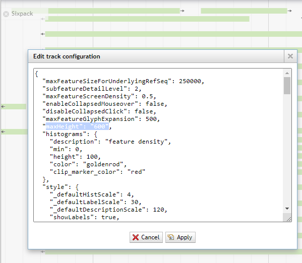

# Apollo FAQ

> ###  My gene name is not editable in the annotation panel!
>    > ###  Solution
>    > * In the current Apollo verion, when open the annotation panel by right click on a gene, the gene name is NOT directly editable. Instead, only the mRNA name is editable and the annotated mRNA name is what is displayed in the annotation track. You need to make edit to mRNA and sync the gene and mRNA name.  Please read [Annotation In Apollo]({{ site.baseurl }}//topics/phage-annotation-pipeline/tutorials/annotation-in-apollo/tutorial.html) for more information.  
> {: .solution}
{: .question}

> ###  My gene/mRNA names edits won’t save!
>    > ###  Solution
>    > * The gene/mRNA name has a special character; *remove it.*
>    > * You haven’t refreshed the page or logged in recently; *refresh the page.*
> {: .solution}
{: .question}

> ###  I cannot delete a gene
>    > ###  Solution
>    > * You need to *double click* on the gene to select the gene and the Shine-Dalgarno feature, and then right click to select delete.
> {: .solution}
{: .question}

> ###  I cannot drag the boundaries of a gene that has a Shine-Dalgarno sequence.
>    > ###  Solution
>    > * Currently the bundaries for genes without Shine-Dalgarno sequences can be modified by directly dragging, but not for genes with Shine-Dalgarno sequences. This is a known issue that we are trying to fix.  Currently we suggest such modification to be carried out in external annotation tools such as Sanger Artemis.  
> {: .solution}
{: .question}

> ###  I cannot view all records of a track and see a "Max height reached" at the bottom of the track.
>    > ###  Solution
>    > * You can change the track display configuration by click on the drop down arrow next to the track name, select "Edit config", and in the config window opened, increase the value under "maxHeight".
>    >
>    > 
> {: .solution}
{: .question}

> ###  Upon logging in to Apollo, the following error message appears.
>    > 
>    >
>    > ###  Solution
>    > * This error message occurs because a FASTA file with a name that did not match the organism in question was applied in a JBrowse job in Galaxy and applied to the organism in Apollo. You can see this in the following images as a mismatch between the names in the Apollo window (ID fields should match). 
>    > 
>    > 
>    >
>    > **Suggested Action:**
>    > * Generate a fresh JBrowse instance to apply to Apollo. **Caution: this will erase your evidence tracks, but not the annotations in the user-created annotations track.** Do this by running the [JBrowse tool](https://cpt.tamu.edu/galaxy/root?tool_id=jbrowse-iuc-cpt), selecting NEW JBrowse instance and pointing it to a fasta sequence with the correct name to match the sequence ID of your Apollo organism (use the [rename tool](https://cpt.tamu.edu/galaxy/root?tool_id=edu.tamu.cpt.seq.rename) if needed, but better to use a fasta generated after [retrieving Data](https://cpt.tamu.edu/galaxy/root?tool_id=export) from Apollo). Finally, run the Create or [Update Organism tool](https://cpt.tamu.edu/galaxy/root?tool_id=create_or_update) and apply the new JBrowse dataset. 
> {: .solution}
{: .question}
