> ###  One of my datasets turned red, what do I do?
>    > ###  Solution
>    > * Sometimes tools fail and the output dataset turns red. A red dataset means that the tool has terminated with an error of some kind. If it was part of a **workflow** and downstream steps were waiting on the failed dataset, the workflow will not continue, and you may see one or more of the queued datasets remain in the paused (light blue) state.  Tools may return errors for a number of reasons, some of which the user can correct.
>    > * A common reason that tools fail is that the user specified an incorrect input dataset or tool parameters. Expand the dataset by clicking on the name. Click on the circular arrow "re-run" button to bring up the tool's original run paramters. Double-check that you selected the correct dataset(s) as input, and that you set any other parameters approriately, and try executing the tool again.
>    > * Click on the bug icon , and read the message that appears - it may give you a clue. [CPT IT staff](http://cpt.tamu.edu) will respond as soon as possible. **Do not rerun the job** unless you are changing some parameter to attempt to fix the problem. Otherwise, the history will be clogged with unnecessary, stalled jobs.
>    > * Examples of common errors include:
>    >    > * *User did not enter common name* - this is where you need to choose the phage name from the drop-down box, or type in a new name for your new organism (unique to Apollo).
>    >    > * *Wrong input* - triple check the file that the tool requires as input. If you have the wrong file type, search the list of tools for a converter.
>    >    > * *Wrong tool used* - read the blurb below each tool to make sure it does what you think it should.
> {: .solution}
{: .question}

> ###  I am seeing an error message in Galaxy; how do I report it?
>    > ###  Solution
>    > * If it isn’t a job-related bug, take a screenshots and [follow the directions here.](https://cpt.tamu.edu/computer-resources/github-repo-list/)
> {: .solution}
{: .question}

> ###  Nothing is working!
>    > ###  Solution
>    > * Check to make sure you are logged in.
>    > * Check your internet connection.
>    > * Try logging into an incognito window.
> {: .solution}
{: .question}

> ###  Structural workflow stalled at second to last step; Create or Update Organism job failed.
>    > ###  Solution
>    > 
>    >
>    > This gives an error that says this in the preview and in the bug report:
>    >
>    > 
>    >
>    > This is because you failed to provide a name for the organism before running the workflow. To fix this, rerun the tool. Enter the appropriate organism name. Also, check *Yes* for "Resume dependencies from this job."
>    >
>    > 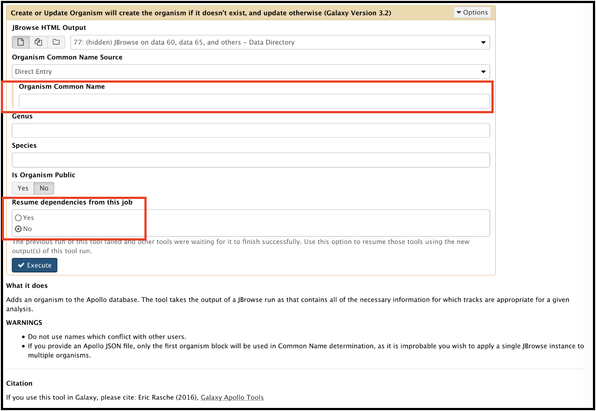
> {: .solution}
{: .question}

> ###  Converting GFF3 of a genome with frameshifted genes into Genbank format files.
>    > ###  Solution
>    > This usually fails when the genes (particularly the tape measure chaperones) in Apollo were not annotated with the correct attributes [put in link to frameshift tutorial]. It can be corrected by adding the attribute tag 'frameshift' and value 'a' to both the genes, then retrieving the data again and re-running the GFF33 to Genbank tool. The error will appear like this in the Galaxy history:
>    >
>    > 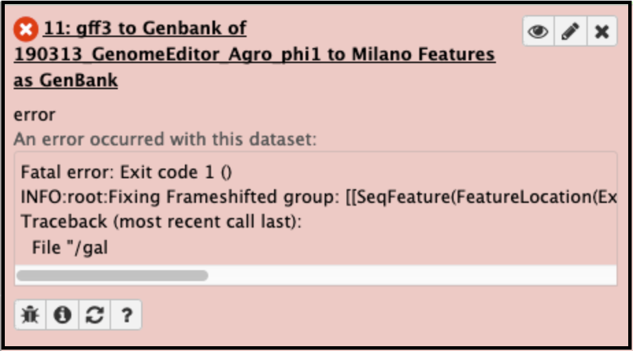
>    >
>    > The Galaxy bug report looks like this:
>    >
>    > 
>    >
>    > Go back to the genome in Apollo and edit the information for BOTH pieces of the frameshifted protein:
>    >
>    > 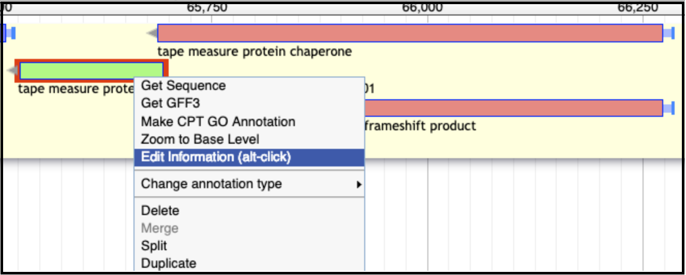
>    >
>    > If the attributes were not added (or did not save):
>    >
>    > 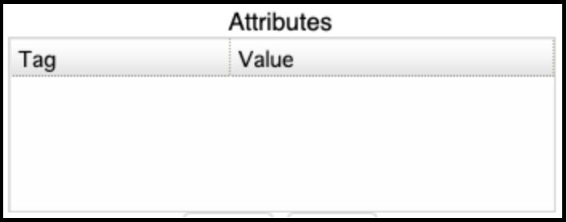
>    >
>    > The correct entry:
>    >
>    > 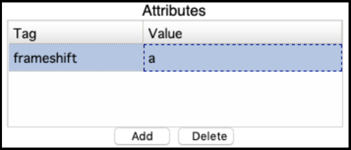
>    >
>    > Now the tool successfully completes, and the frameshift features are properly merged:
>    >
>    > 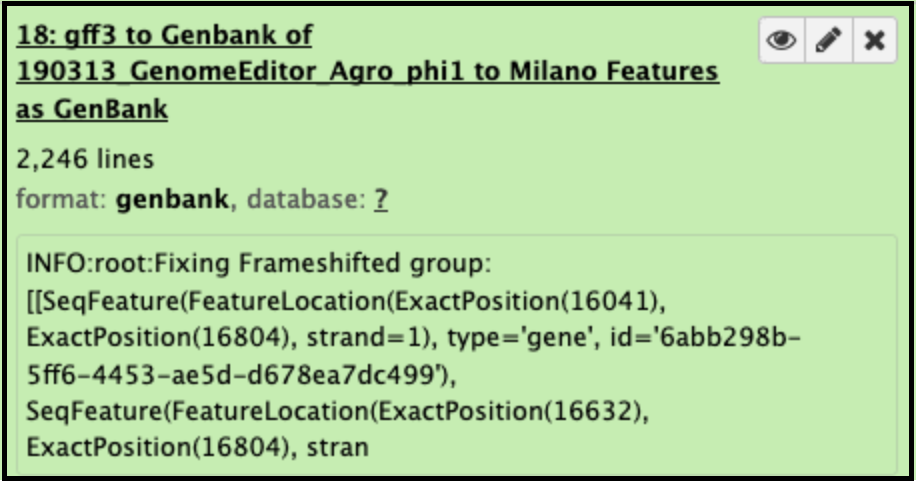
> {: .solution}
{: .question}

> ###  PhageTerm broke on my data!
>    > ###  Solution
>    > When running a [PhageTerm](https://cpt.tamu.edu/galaxy/root?tool_id=PhageTerm) job, the job fails. We do not have a good fix for this problem, as we didn't write the PhageTerm tool (it is published [here(https://www.ncbi.nlm.nih.gov/pubmed/28811656)). A couple common errors, and a few possible solutions are given below.
>    >
>    > Error 1:
>    >
>    > 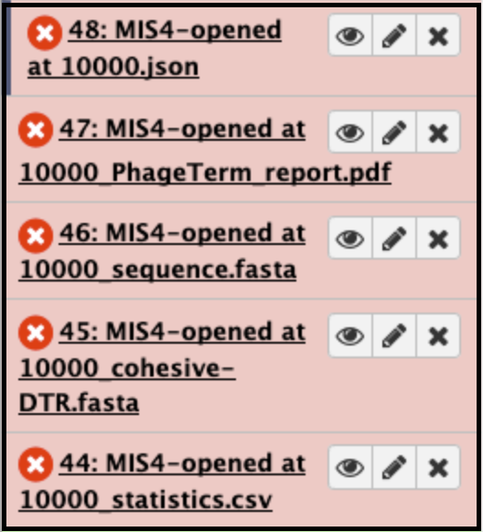
>    >
>    > 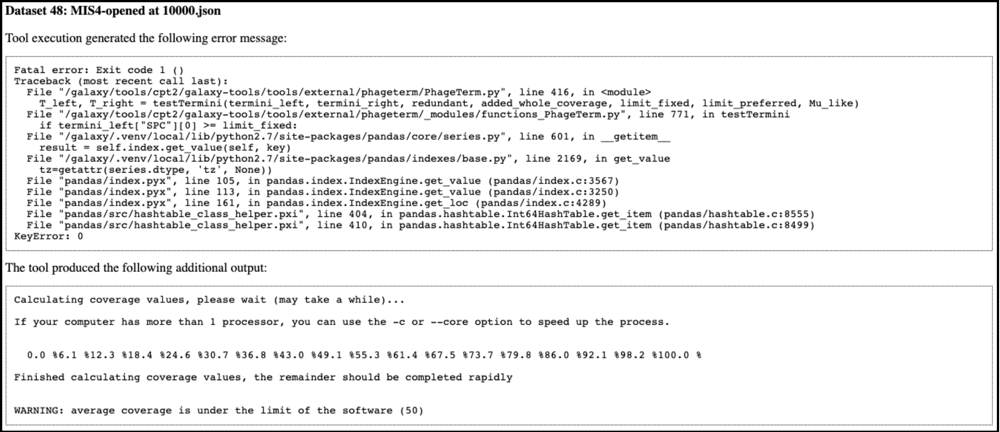
>    >
>    > Error 2:
>    >
>    > 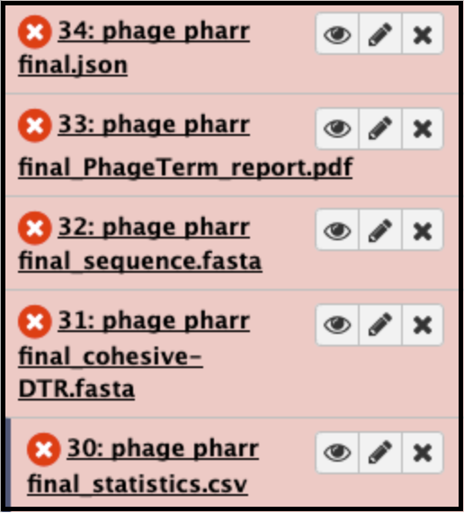
>    >
>    > 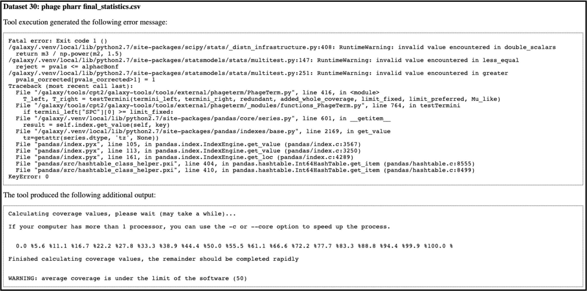
>    >
>    > Error 3 (related to using host genome in the optional input):
>    >
>    > 
>    >
>    > **Possible solutions**:
>    > 1. Re-run [PhageTerm](https://cpt.tamu.edu/galaxy/root?tool_id=PhageTerm) in Galaxy, omitting an input for the optional parameters, including the corresponding paired-end reads and the host genome.
>    > 2. Re-open the genome in another place ([Re-open FASTA sequence](https://cpt.tamu.edu/galaxy/root?tool_id=edu.tamu.cpt.fasta.reopen)). Try running the job again.
>    > 3. It is possible that some phage genome data simply cannot be run through this tool in its current state. We are in communication with the authors to attempt to remedy the situation. If you have encountered a reproducible error when running PhageTerm on a particular dataset, please send us the information (cory.maughmer@tamu.edu) so that the developers can develop a fix for that specific problem.
> {: .solution}
{: .question}
> ###  Why won't my workflow run?
>    > ###  Solution
>    > Sometimes when a worflow will not run, it is because tools in the Workflow may have new versions. Workflow must be opened and saved. If the tool has had new parameters added, those must be manually set (even if they have a preset default value) the first time it is viewed in the workflow edit view. Alternatively, for published workflows, they can be re-imported.
>    >
>    > Here are some useful examples of warnings Galaxy will give in this case:
>    >
>    > Example 1: Galaxy warning messages indicating that tools have changed
>    >
>    > 
>    >
>    >
>    > Example 2: Editor warnings upon the opening of a workflow with tools that have changed. The values mention here may need to be manually set prior to saving.
>    >
>    > 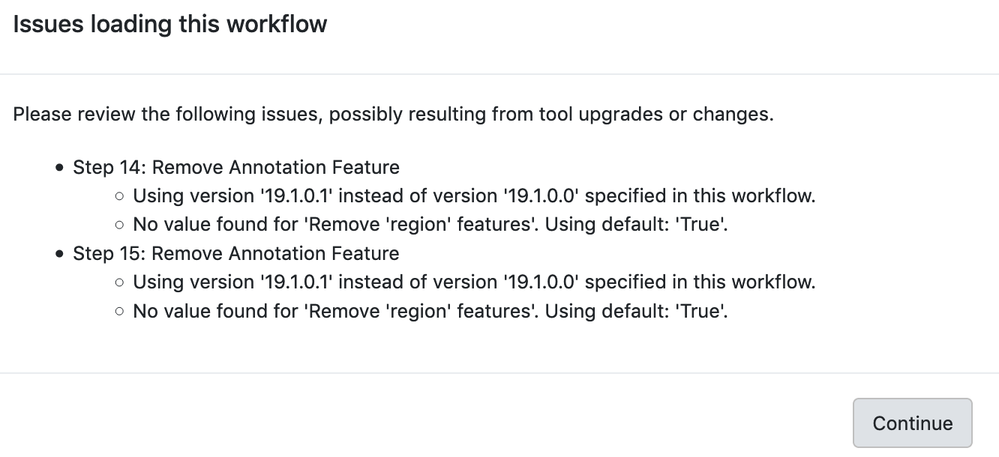
>    >
>    >
>    > Example 3: If error messages are ignored and the user tries to run a workflow even with errors, Galaxy may give a "Workflow failed" message similar to this, which gives the first clue as to which tools are preventing the workflow from running.
>    >
>    > 
>    >
>    >
> {: .solution}
{: .question}
> ###  Why does my top protein or nucleotide hit lists contain duplicate entries? 
>    > **For Example:**
>    > 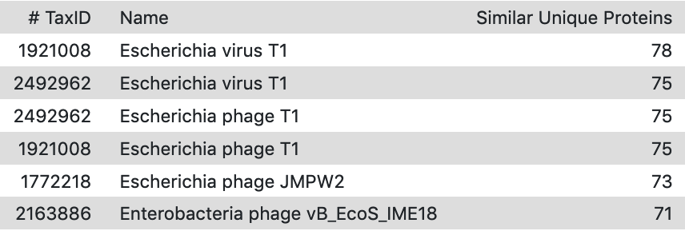
>    > ###  Solution
>    > The duplicate entries are caused when processing of top hits from the BLASTp job separately counts organisms that have a unique accession, or multiple TaxIDs. For organisms with a representative genome in NCBI's RefSeq collection, this will result in duplicate organisms with identical TaxIDs, but unique accessions.(**Figure 1**) For some organisms with many representative genomes in the database, they will have been assigned multiple TaxIDs, each with a unique accession. Both these cases will result in what appear to be duplicates in the Top hits list. 
>    >
>    > Figure 1:
>    >
>    > 
>    >
>    > **Suggested Action:**
>    >
>    >Verify that entries are in fact, representing the same organism. The number of top hits displayed in the output list can be manually adjusted  when running the relatedness tool.
>    > 
>    >
> {: .solution}
{: .question}
> ### Why is the dice score in the Top BLASTn results greater than 1?
>    > **For Example:**
>    > 
>    > ###  Cause
>    > This happens when the aligned length is greater than the total length of query and/or subject length like in Line 1 of the above >  image.
>    >
>    > BLAST results contain full-length high-scoring pairs (HSPs), usually because the query is identical to the subject, plus additional duplicate smaller HSPs. The dice score calculation is (2 * # identical matches)/((genome 1 length) + (genome 2 length)). When adding up all the HSPs from a subject sequence, the additional smaller sequences push the value to slightly greater than one.
>    >
>    >
> {: .solution}
{: .question}
> ###  Why does the output from the GFF3 feature tool has question marks up to the correct sequence length for each gene instead of the actual nucleotide sequence?
>    > 
>    > ###  Cause
>    > The names of the GFF3 and the FASTA don't match. Thus, the downstream tools will run, but not reference the input fasta file to 'extract' features of the length called for by the gff3 file.
>    >
>    > **Suggested Action:**
>    >
>    > Change the names to match. Use the Rename tool for both GFF3 and FASTA files, or the FASTA sequence renamer tool.
>    >
> {: .solution}
{: .question}
