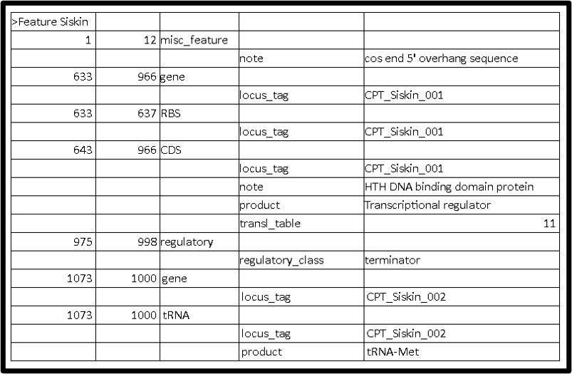
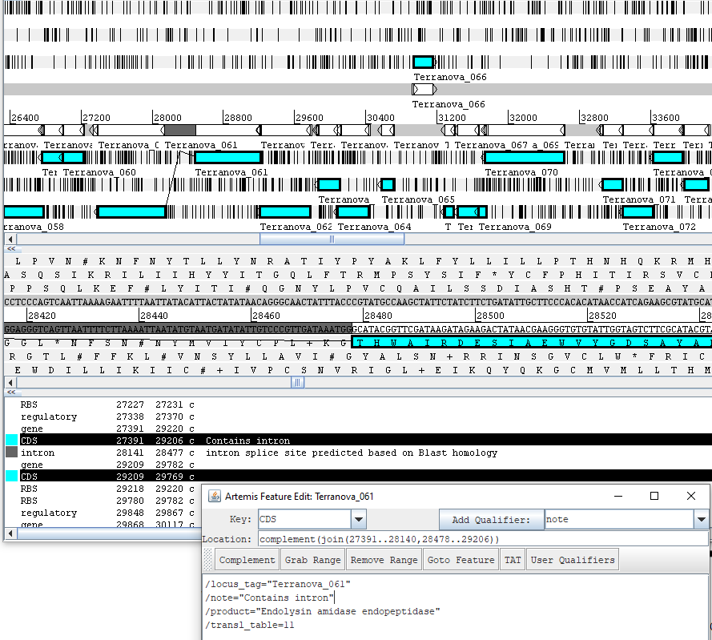
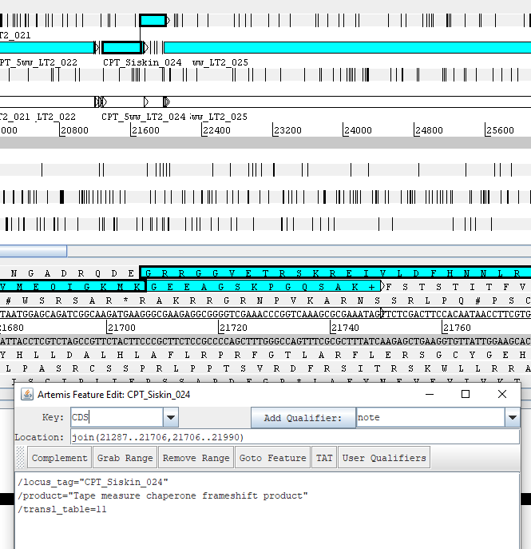
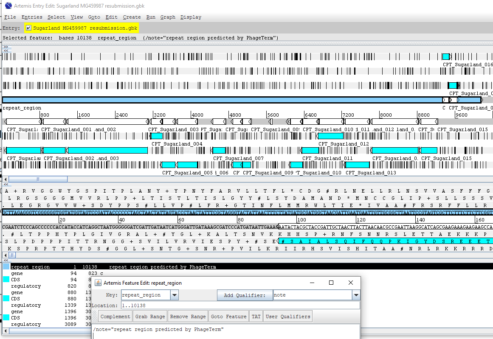
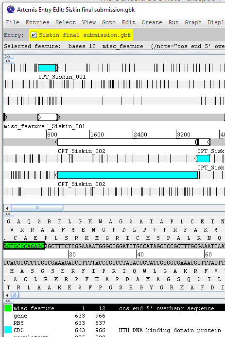

This guide  covers the final steps to prepare an annotated Apollo phage genome record for deposit into Genbank. 

> ### Agenda
>
> 1. Polishing Annotation in Apollo
>    > *  Reviewing all features and naming in Apollo
> 2. Retrieve Apollo Annotation Record into Galaxy
> 3. Fix Special Features not Supported by Apollo
>    > * Locus Tags
>    > * Intron-containing Genes
>    > * Frameshifts
>    > * Merged CDS on the Minus Strand
>    > * Terminal Repeats
>    > * Cos End Sequence
> 4. Final Formatting for Genbank Deposit
>    > * 5-column Table Text File
>    > * DNA Sequence FASTA File
>    > * Source Information
>
{: .agenda}

# Step 1: Polishing Annotation in Apollo
Finalize the genome annotation in Apollo. Check the following before proceeding to the next step.

> * Ensure names conform to the [International Protein Nomenclature Guidelines](https://www.ncbi.nlm.nih.gov/genome/doc/internatprot_nomenguide/), which have been unified between all major organizations that store sequence databases including NCBI and UniProt.
> * As you review the genome, delete unnecessary comments and clean up comments with special characters (such as “) that may break other softwares. 
> * Ensure the frameshift proteins are annotated correctly. See [this guideline](https://cpt.tamu.edu/training-material/topics/phage-annotation-pipeline/tutorials/annotating-tmp-chaperone-frameshifts/tutorial.html) for properly annotated tape measure chaperone frameshift products.
> * Review other special annotation cases such as those covered in [the interrupted genes tutorial](https://cpt.tamu.edu/training-material/topics/additional-analyses/tutorials/finding-interrupted-genes/tutorial.html). 

# Step 2: Retrieve Apollo Annotation Record into Galaxy

> * In Galaxy, run the [Retrieve Data](https://cpt.tamu.edu/galaxy-pub/root?tool_id=export) tool (use this [tool link](https://cpt.tamu.edu/galaxy/root?tool_id=export) if you are CPT internal user).  This gives you two files, “Annotation and Sequence from Apollo” and “Metadata from Apollo”.  The “Annotation and Sequence from Apollo” is a .gff3 file that combines the GFF3 annotation and the genome FASTA sequence. You will need to run this [Split tool](https://cpt.tamu.edu/galaxy-pub/root?tool_id=edu.tamu.cpt2.gff3.splitGff) (use this tool [link](https://cpt.tamu.edu/galaxy/root?tool_id=edu.tamu.cpt2.gff3.splitGff) if you are TAMU user) to separate the “Annotation and Sequence from Apollo” file into a separate GFF3 file (containing only the GFF3 annotation) and a FASTA file (containing only the genome sequence).  
> * If the genome needs to be re-opened, then do that now following this [tutorial](https://cpt.tamu.edu/training-material/topics/additional-analyses/tutorials/reopening-apollo-with-annotations/tutorial.html). If not, proceed with the gff3 to Genbank step below.
>* Run the [Promote Qualifers tool](https://cpt.tamu.edu/galaxy-pub/root?tool_id=edu.tamu.cpt.gff3.promote_qualifiers) ([link](https://cpt.tamu.edu/galaxy/root?tool_id=edu.tamu.cpt.gff3.promote_qualifiers) for TAMU users) to make sure all gene names are in sync with mRNA names (see [Annotation in Apollo](https://cpt.tamu.edu/training-material/topics/phage-annotation-pipeline/tutorials/annotation-in-apollo/tutorial.html) for why this step may be needed) 
> * Run the [GFF3 to GenBank](https://cpt.tamu.edu/galaxy-pub/root?tool_id=edu.tamu.cpt.gff.gff2gb) conversion tool (use this [tool link](https://cpt.tamu.edu/galaxy/root?tool_id=edu.tamu.cpt.gff.gff2gb) if you are CPT internal user).

> ###  Note:
>  At this step, you can use a third party Genbank file editing software, such as [Artemis](http://sanger-pathogens.github.io/Artemis/) to verify, edit and fix problematic features not fully supported by Apollo.  After editing, you can generate a 5 column table (sequin table format) required for Genbank submission by going to File-->Save an entry as -->Sequin table format.  You may also save a DNA sequence FASTA file by going to File-->Write-->All bases-->FASTA format. These are two files required for NCBI submission.  Alternatively, you can skip using Artemis and directly do edits in the 5 column table generated in Galaxy using the [GenBank to 5 Column Table](https://cpt.tamu.edu/galaxy-pub/root?tool_id=edu.tamu.cpt.genbank.GBKtoFiveCol) tool (TAMU user [tool link](https://cpt.tamu.edu/galaxy/root?tool_id=edu.tamu.cpt.genbank.GBKtoFiveCol)).  
{: .tip}

> * Run the [GenBank to 5 Column Table](https://cpt.tamu.edu/galaxy-pub/root?tool_id=edu.tamu.cpt.genbank.GBKtoFiveCol) tool (use this [tool link](https://cpt.tamu.edu/galaxy/root?tool_id=edu.tamu.cpt.genbank.GBKtoFiveCol) if you are CPT internal user) to generate the 5 column table text file, which will be verified and edited before depositing.

# Step 3: Fix Special Features not Supported by Apollo
As stated above, to fix special features not supported by Apollo, You can use [Artemis](http://sanger-pathogens.github.io/Artemis/) to verify, edit the genbank file generated in Step 2.  Refer to [the Artemis manual]( https://sanger-pathogens.github.io/Artemis/Artemis/artemis-manual.html) on how to use Artemis.  Open your Genbank file in Artemis to make sure the special features listed below are correctly annotated if necessary. Basically, you need to examine if locus tags assigned to all gene features are correct and in order. 
If applicable, frameshift products or intron containing genes need to be fused properly at the correct position. Special features such as terminal repeat or cos end sequence (if there is any) needs to be added by creating new feature with appropriate qualifier. The [NCBI rules](https://www.ncbi.nlm.nih.gov/genbank/genomesubmit_annotation/) are the ultimate guidelines on the format that needs to be used in the polished version to deposit. It includes the current standard for features like introns, inteins, etc. Read it to make sure you are still up to date.

>    > #### I. Locus Tags
>    > 
>    >Verify if the locus tags are assigned properly for the tricky features per [NCBI locus tag rules](https://www.ncbi.nlm.nih.gov/genomes/locustag/Proposal.pdf).  If not correct, you need to run the genbank file through [Renumbering](https://cpt.tamu.edu/galaxy-pub/root?tool_id=edu.tamu.cpt.genbank.RelabelTags) tool (use this [tool link](https://cpt.tamu.edu/galaxy/root?tool_id=edu.tamu.cpt.genbank.RelabelTags) if you are CPT internal user) and re-generatet 5 column table to verify again.
>    >
>    > Basically, locus_tags should be assigned to all protein coding and non-coding genes such as structural RNAs.  Locus_tag should appear on gene, mRNA, CDS, 5'UTR, 3'UTR, intron, exon, tRNA, rRNA, misc_RNA, etc within a genome project submission. Repeat_regions do not have locus_tag qualifiers. The same locus_tag should be used for all components of a single gene. 
>    >
>    > For example, all of the exons, CDS, mRNA and gene features for a particular gene would have the same locus_tag. There should only be one locus_tag associated with one gene.  For tRNA, the locus tag assigned usually follows the consecutive order from CDS, rather than assigning a specific prefix.  There should be one gene and one product assigned to each tRNA under the same locus tags.  See below for an example 5 column table.
>    >

> ###  Note:
>  In theory we should check each feature for its locus tag. In practice, check all tRNAs, a couple genes on the plus strand and a couple genes on the minus strand, then spot check through the rest of the way down your genome.
{: .tip}

>    >
>    > 
>    >
>    > #### II. Intron-containing Genes
>    >
>    > Verify the base locations of the intron-containing genes are correct.  Gene feature span should be a single span covering all exons and introns.  The actual CDS feature should be annotated with sets of nucleotide spans showing how the exons are joined to create the correct product. Informative notes such as “Intron splice site predicted by Blast homology to XXXXX” or “intron contains VSR homing endonuclease” can be added.  When exon boundaries can not be identified, only the gene span covering all exons and introns is reported. See [the interrupted genes tutorial](https://cpt.tamu.edu/training-material/topics/additional-analyses/tutorials/finding-interrupted-genes/tutorial.html) for more info. See below screenshots for the example intron containing gene, how two exons are jointed together, and the fused CDS qualifier viewed in the qualifier editing window in Artemis.  How they appear in 5 column table is also shown.  

>    > 
>    >

>    > 
>    >
>    > #### III. Frameshifts
>    >
>    > > > * Make sure the base coordinates of the two joint CDS, such as “join(55078..55479,55478..56029)”, are correct. You can do this by editing the 5 column table.  If you make this edit to your genbank file in Artemis, you can first adjust the bundary of the CDS to the correct frameshift spot (by click on the bundary, hold and drag to the right spot), and then select the two CDS you want to merge, and click on Edit-->Selected features-->Merge.  Or you can edit the base location of the merged CDS in the CDS editing window (select CDS-->Edit-->Select features in editor).    
>    > 
>    > > > * There should be a note “exception=ribosomal slippage” added to the frameshift product.
>    >
>    > > > * Make sure the previously added qualifier “Frameshift protein a” and any other qualifier added in Apollo is stripped.
>    >
>    > > > * Each protein (non-frameshift version and frameshift version) should have their own RBS (which will have the exact same coordinates) and their own locus tags. 
>    >
>    > See below for an example with properly formatted frameshifts viewed in Artemis and in 5 column table.
>    > 
>    >

>    > 
>    >
>    > #### IV. Merged CDS on Minus Strand
>    >
>    > For cases with joint exons or joint frameshift proteins located on minus strand, make sure the order of the two CDS in the 5 column table is correct in order to avoid an error message after NCBI reviews the submission.  Here is an example for the proper order of two merged CDS in a 5 column table (*note the fragment from right side of the genome is listed first in the table*):           
>    >
>    > 
>    >
>    > #### V. Terminal Repeats
>    >
>    > If applicable, add "repeat_region" for terminal repeat with the defined coordinates. The CPT convention is to put the TR at the 5’ end, not repeating the sequence at the 3’ end of the genome.  Add notes such as "direct terminal repeat predicted by PhageTerm", and "right end of genome sequence not duplicated in this record" to indicate that the bases are not repeated in the genome deposited, but that that sequence (and its genes) are present in the viral genome.  See below for terminal repeat examples viewed in Artemis and in 5 column table.
>    > 

>    >

>    > 
>    >
>    > #### VI. Cos End Sequence
>    >
>    > If applicable, add "misc_feature" for cos end sequence with the defined coordinates to indicate the cos end sequence . See below for examples viewed in Artemis and in 5 column table.

>    > 
>    >
>    > 
>    >

> ###  Note:
>  If you made the above edits in genbank file in Artemis, you can generate a 5 column table (sequin table format) required for Genbank submission by going to File-->Save an entry as -->Sequin table format.  You may also save a DNA sequence FASTA file by going to File-->Write-->All bases-->FASTA format. Alternatively, you can use the DNA sequence file you retrieved from Apollo ealier. 
{: .tip}
 

# Step 4: Final Formatting for GenBank Deposit
For Genbank submission through [BankIt](https://www.ncbi.nlm.nih.gov/WebSub/?tool=genbank), you need to provide a 5 column table text file, a DNA sequence FASTA file, and fill in genome source information as required. 

>    > #### I. 5-column Table Text File
>    >
>    > > > * Check the feature table header, it should be >Feature Phagename (such as >Feature Minorna).  All the locus tags in the table can be “CPT_phagename_00X” (such as CPT_ Minorna_00X).
>    > >
>    > > > * Change phage name if needed.  In the 5 column table file, execute **Find and Replace** in a text editor.  Be careful if editing in Excel or Word because it can insert characters upon saving that **break** the NCBI uploader.
>    >
>    > #### II. DNA Sequence FASTA File
>    >
>    > > > * Check the header, it should be >Phagename (such as >Minorna).  **This header has to match the name after “Feature” in 5 column table header.**
>    >
>    > #### III. Source Information
>    >
>    > Gather all source information (source info example is shown below), which are needed when you follow [BankIt](https://www.ncbi.nlm.nih.gov/WebSub/?tool=genbank) to deposit the 5 column table file and the DNA FASTA file to Genbank. 
>    >
>    > 
>    >

