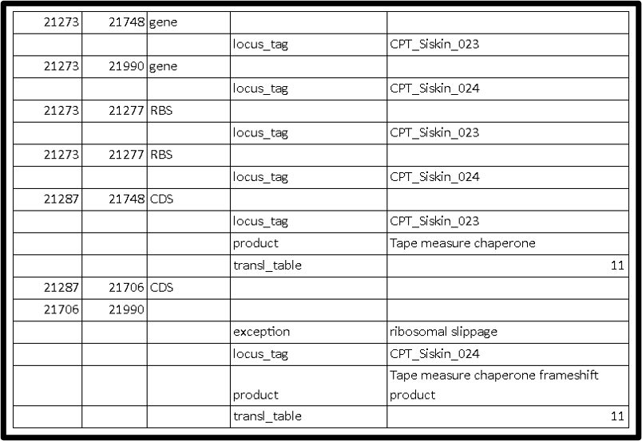
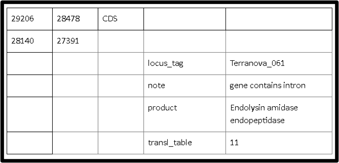

This guide  covers the final steps followed to prepare an annotated Apollo phage genome record for deposit into Genbank. **First**, finalize all annotations for the Apollo record.  Reviewing all features and naming in Apollo. All feature addition, deletion, and evidence track reviewing should be completed before moving to the next step. **Second**, retrieve the annotation record out of Apollo into Galaxy and turn it into a 5-column table file.  **Next**, examine the genome features that Apollo cannot reliably support and fix manually in the local copy of the 5-column table.  This includes properly fusing frameshift proteins, adding terminal repeat features, and adding notes required by NCBI.  **Finally**, the generated 5-column table and the genome DNA FASTA files are used to deposit into Genbank.

> ### Agenda
>
> 1. Polishing Annotation in Apollo
> 2. Retrieve Apollo Annotation Record into Galaxy
> 3. Fix Special Features not Supported by Apollo
>    > * Locus Tags
>    > * Intron-containing Genes
>    > * Frameshifts
>    > * Merged CDS on the Minus Strand
>    > * Terminal Repeats
>    > * Cos End Sequence
> 4. Final Formatting for Genbank Deposit
>    > * 5-column Table Text File
>    > * DNA Sequence FASTA File
>    > * Source Information
>
{: .agenda}

# Step 1: Polishing Annotation in Apollo
Finalize the genome annotation in Apollo. Check the following before proceeding to the next step.

> * Ensure names conform to the [International Protein Nomenclature Guidelines](https://www.ncbi.nlm.nih.gov/genome/doc/internatprot_nomenguide/), which have been unified between all major organizations that store sequence databases including NCBI and UniProt.
> * As you review the genome, delete unnecessary comments and clean up comments with special characters (such as “) that may break other softwares. 
> * Ensure the frameshift proteins are annotated correctly.  See this guideline  (link frameshift tutorial) for properly annotated tape measure chaperone frameshift products. 
> * Ensure the frameshift proteins are annotated correctly. See [this guideline](https://cpt.tamu.edu/training-material/topics/phage-annotation-pipeline/tutorials/annotating-tmp-chaperone-frameshifts/tutorial.html) for properly annotated tape measure chaperone frameshift products.
> * Review other special annotation cases such as those promoted by [Intron Detection](https://cpt.tamu.edu/galaxy-pub/root?tool_id=edu.tamu.cpt2.phage.intron_detection) tool.

# Step 2: Retrieve Apollo Annotation Record into Galaxy

> * In Galaxy, run the CPT [Retrieve Data](https://cpt.tamu.edu/galaxy-pub/root?tool_id=edu.tamu.cpt2.webapollo.export) tool.
> * If the genome needs to be re-opened, then do that now following this [tutorial](https://cpt.tamu.edu/training-material/topics/additional-analyses/tutorials/reopening-apollo-with-annotations/tutorial.html). If not, proceed with the gff3 to Genbank step below.
> * Run the [GFF3 to GenBank](https://cpt.tamu.edu/galaxy-pub/root?tool_id=edu.tamu.cpt.gff.gff2gb) conversion tool.
> * Run the [GenBank to 5 Column Table](https://cpt.tamu.edu/galaxy-pub/root?tool_id=edu.tamu.cpt.genbank.GBKtoFiveCol) tool to generate the 5 column table text file, which will be verified and edited before depositing to GenBank.

# Step 3: Fix Special Features not Supported by Apollo
In the 5 column table generated from **Step 2**, examine if locus tags assigned to all gene features are correct and in order.  Also examine the genome features that are not reliably supported by Apollo, and fix manually in the 5-column table if necessary.  This includes making sure frameshift proteins are fused properly, special features such as terminal repeats or cos site sequences are added, and special qualifiers required by NCBI are added.  The [NCBI rules](https://www.ncbi.nlm.nih.gov/genbank/genomesubmit_annotation/) are the ultimate guidelines word on the format that needs to be used in the polished version to deposit. It includes the current standard for features like introns, inteins, etc. Read it to make sure you are still up to date.

> ###  Note:
>  An alternative to fixing the 5 column table is to use a third party Genbank file editing software, such as [Artemis](http://sanger-pathogens.github.io/Artemis/) to edit and fix problematic features.  Open your Genbank file in Artemis to proceed with the editing and generating a 5 column table (sequin table format) required for Genbank submission.  This guide does not cover how to edit a Genbank file in Artemis.  
{: .tip}

Typically we verify the following:
>    > ### I. Locus Tags
>    > 
>    >Verify if the locus tags are assigned properly for the tricky features per [NCBI locus tag rules](https://www.ncbi.nlm.nih.gov/genomes/locustag/Proposal.pdf).  If not correct, you need to run the [Renumbering](https://cpt.tamu.edu/galaxy-pub/root?tool_id=edu.tamu.cpt.genbank.RelabelTags) tool and verify again.
>    >
>    > Basically, locus_tags should be assigned to all protein coding and non-coding genes such as structural RNAs.  Locus_tag should appear on gene, mRNA, CDS, 5'UTR, 3'UTR, intron, exon, tRNA, rRNA, misc_RNA, etc within a genome project submission. Repeat_regions do not have locus_tag qualifiers. The same locus_tag should be used for all components of a single gene. 
>    >
>    > For example, all of the exons, CDS, mRNA and gene features for a particular gene would have the same locus_tag. There should only be one locus_tag associated with one /gene, i.e. if a /locus_tag is associated with a /gene symbol in any feature, that gene symbols (and only that /gene symbol) must also be present on every other feature that contains that locus_tag.  For tRNA, the locus tag assigned usually follows the consecutive order from CDS, rather than assigning a specific prefix.  There should be one gene and one product assigned to each tRNA under the same locus tags.
>    >
>    > > ###  Note:
>    > >  In theory we should check each feature for its locus tag. In practice, check all tRNAs, a couple genes on the plus strand and a couple genes on the minus strand, then spot check through the rest of the way down your genome.
  
>    > > {: .tip}
>    >
>    > See below for an example 5 column table
>    > 
>    >
>    > ### II. Intron-containing Genes
>    >
>    > Verify the base location of the intron-containing genes are correct.  Gene feature spans should be a single span covering all exons and introns.  The actual CDS feature should be annotated with sets of nucleotide spans showing how the exons are joined to create the correct product. Informative notes such as “Intron splice site predicted by Blast homology to XXXXX” or “intron contains VSR homing endonuclease” can be added.  When exon boundaries can not be identified, only the gene span covering all exons and introns is reported. See [here](https://cpt.tamu.edu/training-material/topics/additional-analyses/tutorials/finding-interrupted-genes/tutorial.html) for more info. 
>    >
>    > ### III. Frameshifts
>    >
>    > > A. Make sure the base coordinates of the two joint CDS, such as “join(55078..55479,55478..56029)”, are correct. 
>    > 
>    > > B. There should be a note “exception=ribosomal slippage” added to the frameshift product.
>    >
>    > > C. Make sure the previously added qualifier “Frameshift protein a” and any other qualifier added in Apollo is stripped.
>    >
>    > > D. Each protein (non-frameshift version and frameshift version) should have their own RBS (which will have the exact same coordinates) and their own locus tags.  
>    >
>    > See below for an example with properly formatted frameshifts.
>    > 
>    >
>    > ### IV. Merged CDS on the Minus Strand
>    >
>    > For cases with joint exons or joint frameshift proteins located on minus strand, make sure the order of the two CDS in the 5 column table is correct in order to avoid an error message during Genbank submission.  >    >
>    > Here is an example for the proper order of two merged CDS in a 5 column table (*note the fragment from right side of the genome is listed first in the table*):
>    > 
>    >
>    > ### V. Terminal Repeats
>    >
>    > If applicable, add "misc_feature" for terminal repeat with the defined coordinates. The CPT convention is to put the TR at the 5’ end, not repeating the sequence at the 3’ end of the genome.  Add notes such as "direct terminal repeat predicted by PhageTerm", and "right end of genome sequence not duplicated in this record" to indicate that the bases are not repeated in the genome deposited, but that that sequence (and its genes) are present in the viral genome.  See below for an example.
>    > 
>    >
>    > ### VI. Cos End Sequence
>    >
>    > If applicable, add "misc_feature" for cos end sequence with the defined coordinates to indicate the cos end sequence . See below for an example.
>    > 
>    >

# Step 4: Final Formatting for GenBank Deposit
For Genbank submission through [BankIt](https://www.ncbi.nlm.nih.gov/WebSub/?tool=genbank), you need to provide a 5 column table text file, a DNA sequence FASTA file, and genome source information. 

>    > ### I. 5-column Table Text File
>    >
>    > > A. Check the feature table header, it should be >Feature Phagename (such as >Feature Minorna).  All the locus tags in the table can be “CPT_phagename_00X” (such as CPT_ Minorna_00X).
>    > >
>    > > B. Change phage name if needed.  In the 5 column table, execute **Find and Replace** in a text editor.  Be careful with Excel or Word because it can insert characters upon saving that **break** the NCBI uploader.
>    >
>    > ### II. DNA Sequence FASTA File
>    >
>    > > A. Check the header, it should be >Phagename (such as >Minorna).  **This header has to match the name after “Feature” in 5 column table header.**
>    >
>    > ### III. Source Information
>    >
>    > Gather all source information (an example is shown below), which are needed when you follow [BankIt](https://www.ncbi.nlm.nih.gov/WebSub/?tool=genbank) to deposit the 5 column table file and the DNA FASTA file to Genbank. 
>    >
>    > 
>    >

